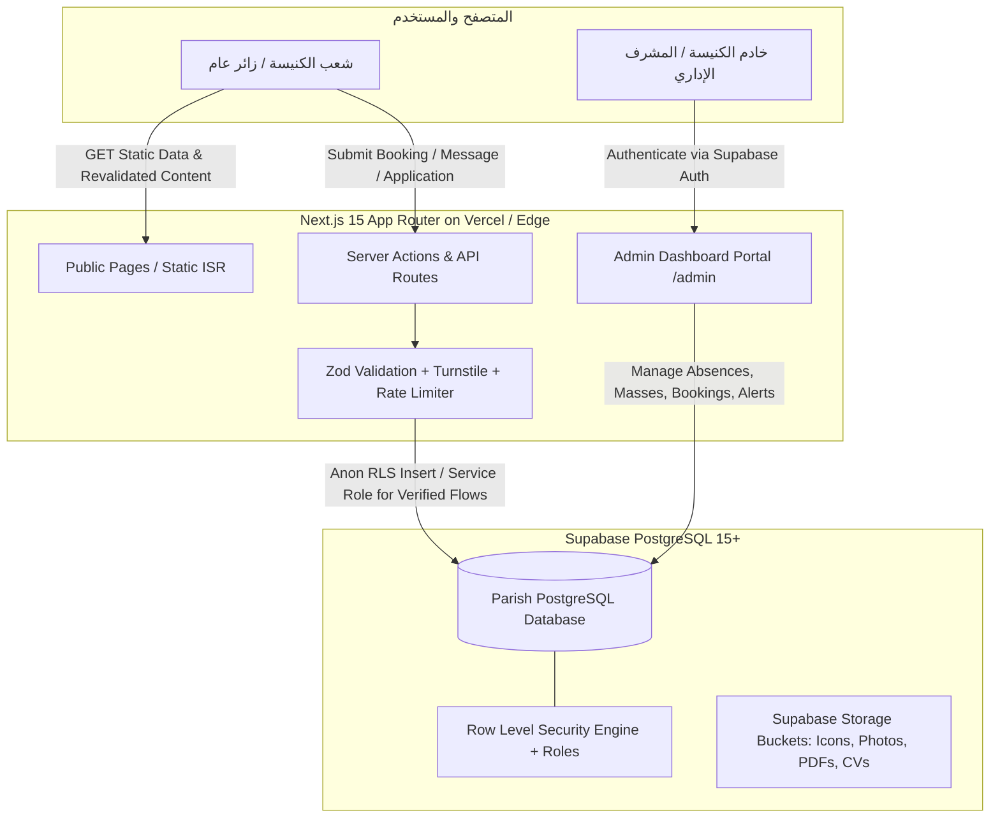

# مواصفات قواعد البيانات والخلفية البرمجية (Backend, Database & Security Specification)
## البوابة الرقمية لكنيسة القديسين مكسيموس ودوماديوس والشهيد الأنبا موسى الأسود
**الإصدار:** 1.1.0 | **المعيار الهندسي:** Next.js 15 Server Actions + Supabase PostgreSQL 15+ (`@supabase/ssr`) | **مستوى الأمان:** Enterprise RLS + Role-Based Access

> **ما الجديد في v1.1**: نموذج أدوار إداري محكم (`profiles` + `is_staff()`/`is_admin()`)، جداول الاستثناءات والتنبيهات والبث والتسجيلات والكتاب المقدس، مسار القراءة الموحد وسجل وسوم إعادة التحقق، إصلاح مسار الحجز وتتبعه، وبيانات تشغيلية للتحقق من الروبوتات وحد الطلبات.

---

## 1. المعمارية السحابية وتدفق البيانات (System Architecture & Data Flow)

تعتمد البوابة نمط **Modern Headless Backend** بالارتكاز على منصة Supabase (PostgreSQL 15+) مع طبقة معالجة مدمجة عبر Next.js 15 Server Actions وشبكة تسليم حافة (Edge Network). إدارة الجلسات عبر الحزمة الرسمية **`@supabase/ssr`** فقط (الحزمة القديمة `@supabase/auth-helpers-nextjs` مهجورة وممنوعة في هذا المشروع):



---

## 2. الأدوار والحسابات الإدارية (Roles & Staff Profiles) — جديد v1.1

لا يجوز منح أي صلاحية كتابة لـ `authenticated` العام. تُدار الصلاحيات عبر جدول ملفات موظفين مرتبط بـ `auth.users`:

```sql
-- -----------------------------------------------------------------------------
-- 2.1 أنواع الأدوار
-- -----------------------------------------------------------------------------
CREATE TYPE staff_role_enum AS ENUM ('admin', 'secretary', 'servant', 'priest');

-- -----------------------------------------------------------------------------
-- 2.2 ملفات الطاقم الكنسي (profiles)
-- -----------------------------------------------------------------------------
CREATE TABLE profiles (
    id UUID PRIMARY KEY REFERENCES auth.users(id) ON DELETE CASCADE,
    full_name_ar VARCHAR(200) NOT NULL,
    role staff_role_enum NOT NULL DEFAULT 'servant',
    is_active BOOLEAN DEFAULT TRUE,
    created_at TIMESTAMPTZ DEFAULT NOW(),
    updated_at TIMESTAMPTZ DEFAULT NOW()
);

-- إنشاء ملف تلقائي عند أول تسجيل مستخدم (الافتراضي: servant بلا أي صلاحيات كتابة حتى يرقّيه admin)
CREATE OR REPLACE FUNCTION handle_new_user() RETURNS trigger
LANGUAGE plpgsql SECURITY DEFINER SET search_path = public AS $$
BEGIN
  INSERT INTO profiles (id, full_name_ar, role)
  VALUES (NEW.id, COALESCE(NEW.raw_user_meta_data->>'full_name_ar', 'خادم جديد'), 'servant');
  RETURN NEW;
END; $$;

CREATE TRIGGER on_auth_user_created
AFTER INSERT ON auth.users
FOR EACH ROW EXECUTE FUNCTION handle_new_user();

-- -----------------------------------------------------------------------------
-- 2.3 دوال التحقق من الدور (SECURITY DEFINER لتجنب الاستعلام التكراري في السياسات)
-- -----------------------------------------------------------------------------
CREATE OR REPLACE FUNCTION is_staff() RETURNS boolean
LANGUAGE sql SECURITY DEFINER STABLE SET search_path = public AS $$
  SELECT EXISTS (
    SELECT 1 FROM profiles
    WHERE id = auth.uid() AND is_active
      AND role IN ('admin', 'secretary', 'servant', 'priest')
  );
$$;

CREATE OR REPLACE FUNCTION is_admin() RETURNS boolean
LANGUAGE sql SECURITY DEFINER STABLE SET search_path = public AS $$
  SELECT EXISTS (
    SELECT 1 FROM profiles WHERE id = auth.uid() AND role = 'admin' AND is_active
  );
$$;
```

> **Bootstrap إلزامي (خطوة نشر يدوية):** بعد إنشاء أول حساب مدير عبر Supabase Auth، نفّذ في SQL Editor:
> `UPDATE profiles SET role = 'admin' WHERE id = '<uuid-of-first-admin>';`
> لا يوجد أي مسار آخر لترقية مدير أول — قرارات ترقية الأدوار قرار روحي إداري (`ready-for-human`).

---

## 3. مخطط قاعدة البيانات الكامل (Complete SQL DDL Schema)

```sql
-- =============================================================================
-- مخطط قاعدة البيانات للبوابة الرسمية لكنيسة القديسين مكسيموس ودوماديوس والأنبا موسى الأسود
-- Database: PostgreSQL 15+ (Supabase) — v1.1.0
-- =============================================================================

CREATE EXTENSION IF NOT EXISTS "uuid-ossp";
CREATE EXTENSION IF NOT EXISTS "pg_trgm";

-- -----------------------------------------------------------------------------
-- 3.1 الأنواع المخصصة (Custom ENUMs)
-- -----------------------------------------------------------------------------
CREATE TYPE day_of_week_enum AS ENUM (
    'Sunday', 'Monday', 'Tuesday', 'Wednesday', 'Thursday', 'Friday', 'Saturday'
);

CREATE TYPE booking_status_enum AS ENUM (
    'pending', 'approved', 'rejected', 'cancelled'
);

CREATE TYPE education_level_enum AS ENUM (
    'preparatory', 'elementary', 'advanced', 'diploma', 'general'
);

CREATE TYPE contact_urgency_enum AS ENUM (
    'normal', 'spiritual_urgent', 'confession_request', 'emergency'
);

-- جديد v1.1
CREATE TYPE staff_role_enum AS ENUM ('admin', 'secretary', 'servant', 'priest');
CREATE TYPE exception_action_enum AS ENUM ('cancelled', 'added', 'modified');
CREATE TYPE alert_severity_enum AS ENUM ('info', 'warning', 'urgent');
CREATE TYPE stream_status_enum AS ENUM ('scheduled', 'live', 'completed');
CREATE TYPE application_status_enum AS ENUM ('pending', 'contacted', 'accepted', 'rejected', 'waitlisted');
```

*(جدولا `profiles` و`staff_role_enum` معرّفان في القسم 2 أعلاه.)*

### 3.2 جداول المحتوى العام (كما في v1.0 مع التعديلات المعلّمة)

```sql
-- 1. المذابح (altars) — بلا تغيير
CREATE TABLE altars (
    id UUID PRIMARY KEY DEFAULT uuid_generate_v4(),
    name_ar VARCHAR(255) NOT NULL,
    name_en VARCHAR(255),
    patron_saint VARCHAR(255) NOT NULL,
    consecration_date DATE,
    description_ar TEXT NOT NULL,
    historical_notes TEXT,
    image_url TEXT,
    display_order INT DEFAULT 1,
    is_active BOOLEAN DEFAULT TRUE,
    created_at TIMESTAMPTZ DEFAULT NOW(),
    updated_at TIMESTAMPTZ DEFAULT NOW()
);

-- 2. الكهنة (clergy) — بلا تغيير
CREATE TABLE clergy (
    id UUID PRIMARY KEY DEFAULT uuid_generate_v4(),
    clerical_name_ar VARCHAR(255) NOT NULL,
    clerical_name_en VARCHAR(255),
    rank_title_ar VARCHAR(100) DEFAULT 'قس',
    ordination_date DATE NOT NULL,
    hegumen_date DATE,
    feast_day VARCHAR(150),
    responsibilities_ar TEXT NOT NULL,
    confession_hours_ar TEXT NOT NULL,
    phone_office VARCHAR(50),
    whatsapp_number VARCHAR(50),
    email VARCHAR(255),
    photo_url TEXT,
    bio_ar TEXT,
    display_order INT DEFAULT 1,
    is_active BOOLEAN DEFAULT TRUE,
    created_at TIMESTAMPTZ DEFAULT NOW(),
    updated_at TIMESTAMPTZ DEFAULT NOW()
);

-- 3. القداسات الأسبوعية (mass_schedules) — بلا تغيير
CREATE TABLE mass_schedules (
    id UUID PRIMARY KEY DEFAULT uuid_generate_v4(),
    altar_id UUID NOT NULL REFERENCES altars(id) ON DELETE RESTRICT,
    celebrant_priest_id UUID REFERENCES clergy(id) ON DELETE SET NULL,
    day_of_week day_of_week_enum NOT NULL,
    title_ar VARCHAR(150) NOT NULL,
    start_time TIME NOT NULL,
    end_time TIME NOT NULL,
    target_group_ar VARCHAR(150) DEFAULT 'عام لجميع الشعب',
    notes_ar TEXT,
    is_seasonal BOOLEAN DEFAULT FALSE,
    is_active BOOLEAN DEFAULT TRUE,
    created_at TIMESTAMPTZ DEFAULT NOW(),
    updated_at TIMESTAMPTZ DEFAULT NOW()
);

-- 4. تخصصات العيادات (clinic_specialties) — بلا تغيير
CREATE TABLE clinic_specialties (
    id UUID PRIMARY KEY DEFAULT uuid_generate_v4(),
    name_ar VARCHAR(150) NOT NULL UNIQUE,
    name_en VARCHAR(150) NOT NULL UNIQUE,
    slug VARCHAR(150) NOT NULL UNIQUE,
    description_ar TEXT,
    room_number VARCHAR(50),
    icon_name VARCHAR(100) DEFAULT 'Stethoscope',
    display_order INT DEFAULT 1,
    is_active BOOLEAN DEFAULT TRUE,
    created_at TIMESTAMPTZ DEFAULT NOW(),
    updated_at TIMESTAMPTZ DEFAULT NOW()
);

-- 5. الأطباء (clinic_doctors) — تغيير v1.1: تسمية العمود وفق الثابت اللفظي في CONTEXT.md §3
CREATE TABLE clinic_doctors (
    id UUID PRIMARY KEY DEFAULT uuid_generate_v4(),
    specialty_id UUID NOT NULL REFERENCES clinic_specialties(id) ON DELETE RESTRICT,
    full_name_ar VARCHAR(255) NOT NULL,
    full_name_en VARCHAR(255),
    academic_title_ar VARCHAR(150) NOT NULL,
    sub_specialty_ar VARCHAR(255),
    photo_url TEXT,
    schedule_details_ar TEXT NOT NULL,
    consultation_fee_egp NUMERIC(8, 2) DEFAULT 30.00,  -- كان ticket_price_egp
    is_active BOOLEAN DEFAULT TRUE,
    display_order INT DEFAULT 1,
    created_at TIMESTAMPTZ DEFAULT NOW(),
    updated_at TIMESTAMPTZ DEFAULT NOW()
);

-- 6. سلوتات عمل الأطباء (doctor_schedule_slots) — بلا تغيير
CREATE TABLE doctor_schedule_slots (
    id UUID PRIMARY KEY DEFAULT uuid_generate_v4(),
    doctor_id UUID NOT NULL REFERENCES clinic_doctors(id) ON DELETE CASCADE,
    day_of_week day_of_week_enum NOT NULL,
    start_time TIME NOT NULL,
    end_time TIME NOT NULL,
    max_patients INT DEFAULT 20,
    is_active BOOLEAN DEFAULT TRUE,
    created_at TIMESTAMPTZ DEFAULT NOW()
);

-- 7. اعتذارات الأطباء (doctor_absences) — بلا تغيير
CREATE TABLE doctor_absences (
    id UUID PRIMARY KEY DEFAULT uuid_generate_v4(),
    doctor_id UUID NOT NULL REFERENCES clinic_doctors(id) ON DELETE CASCADE,
    absence_date DATE NOT NULL,
    reason_ar VARCHAR(255) DEFAULT 'اعتذار لظرف طارئ',
    substitute_doctor_id UUID REFERENCES clinic_doctors(id) ON DELETE SET NULL,
    recorded_by_servant VARCHAR(150),
    created_at TIMESTAMPTZ DEFAULT NOW()
);

-- 8. الاجتماعات (church_meetings) — بلا تغيير (11 قطاعاً في البذر)
CREATE TABLE church_meetings (
    id UUID PRIMARY KEY DEFAULT uuid_generate_v4(),
    name_ar VARCHAR(200) NOT NULL,
    slug VARCHAR(100) NOT NULL UNIQUE,
    target_age_ar VARCHAR(150) NOT NULL,
    patron_saint VARCHAR(150),
    motto_verse_ar TEXT NOT NULL,
    bible_reference VARCHAR(100) NOT NULL,
    day_of_week day_of_week_enum NOT NULL,
    start_time TIME NOT NULL,
    end_time TIME NOT NULL,
    location_hall_ar VARCHAR(150) NOT NULL,
    supervising_priest_id UUID REFERENCES clergy(id) ON DELETE SET NULL,
    servant_in_charge_ar VARCHAR(200) NOT NULL,
    whatsapp_group_link TEXT,
    telegram_channel_link TEXT,
    description_ar TEXT NOT NULL,
    cover_image_url TEXT,
    display_order INT DEFAULT 1,
    is_active BOOLEAN DEFAULT TRUE,
    created_at TIMESTAMPTZ DEFAULT NOW(),
    updated_at TIMESTAMPTZ DEFAULT NOW()
);

-- 9. المدارس والأكاديميات (schools_academies) — بلا تغيير (5 صفوف في البذر)
CREATE TABLE schools_academies (
    id UUID PRIMARY KEY DEFAULT uuid_generate_v4(),
    name_ar VARCHAR(200) NOT NULL,
    slug VARCHAR(100) NOT NULL UNIQUE,
    category_type VARCHAR(100) NOT NULL,
    curriculum_summary_ar TEXT NOT NULL,
    academic_stages_count INT DEFAULT 1,
    registration_open BOOLEAN DEFAULT FALSE,
    registration_start_date DATE,
    registration_deadline DATE,
    responsible_servant_ar VARCHAR(200) NOT NULL,
    study_schedule_ar TEXT NOT NULL,
    is_active BOOLEAN DEFAULT TRUE,
    created_at TIMESTAMPTZ DEFAULT NOW(),
    updated_at TIMESTAMPTZ DEFAULT NOW()
);

-- 10. الأنشطة (activities) — بلا تغيير
CREATE TABLE activities (
    id UUID PRIMARY KEY DEFAULT uuid_generate_v4(),
    name_ar VARCHAR(200) NOT NULL,
    slug VARCHAR(100) NOT NULL UNIQUE,
    category VARCHAR(100) NOT NULL,
    description_ar TEXT NOT NULL,
    target_audience_ar VARCHAR(150) NOT NULL,
    schedule_text_ar TEXT NOT NULL,
    location_ar VARCHAR(150) NOT NULL,
    responsible_servant_ar VARCHAR(200) NOT NULL,
    whatsapp_link TEXT,
    display_order INT DEFAULT 1,
    is_active BOOLEAN DEFAULT TRUE,
    created_at TIMESTAMPTZ DEFAULT NOW()
);

-- 11. الخدمات العامة (public_services) — بلا تغيير
CREATE TABLE public_services (
    id UUID PRIMARY KEY DEFAULT uuid_generate_v4(),
    name_ar VARCHAR(200) NOT NULL,
    slug VARCHAR(100) NOT NULL UNIQUE,
    service_type VARCHAR(100) NOT NULL,
    description_ar TEXT NOT NULL,
    working_hours_ar VARCHAR(200) NOT NULL,
    location_ar VARCHAR(150) NOT NULL,
    contact_phone VARCHAR(50),
    contact_whatsapp VARCHAR(50),
    guidelines_ar TEXT,
    display_order INT DEFAULT 1,
    is_active BOOLEAN DEFAULT TRUE,
    created_at TIMESTAMPTZ DEFAULT NOW()
);

-- 12. حجوزات قاعة العزاء (condolence_bookings)
CREATE TABLE condolence_bookings (
    id UUID PRIMARY KEY DEFAULT uuid_generate_v4(),
    booking_reference_code VARCHAR(20) NOT NULL UNIQUE,
    deceased_full_name VARCHAR(255) NOT NULL,
    applicant_name VARCHAR(255) NOT NULL,
    applicant_phone VARCHAR(50) NOT NULL,
    applicant_national_id VARCHAR(30),
    relationship_to_deceased VARCHAR(100) NOT NULL,
    event_date DATE NOT NULL,
    slot_time VARCHAR(100) DEFAULT 'مسائي من 6:00 م إلى 10:00 م',
    hall_name VARCHAR(100) DEFAULT 'قاعة العزاء الرئيسية المجهزة',
    special_requests TEXT,
    status booking_status_enum DEFAULT 'pending',
    rejection_reason TEXT,
    approved_by_priest_id UUID REFERENCES clergy(id) ON DELETE SET NULL,
    created_at TIMESTAMPTZ DEFAULT NOW(),
    updated_at TIMESTAMPTZ DEFAULT NOW(),
    CONSTRAINT chk_future_event_date CHECK (event_date >= CURRENT_DATE - INTERVAL '1 day')
);

-- 13. رسائل التواصل (contact_messages) — بلا تغيير
CREATE TABLE contact_messages (
    id UUID PRIMARY KEY DEFAULT uuid_generate_v4(),
    sender_name VARCHAR(255) NOT NULL,
    sender_phone VARCHAR(50) NOT NULL,
    sender_email VARCHAR(255),
    urgency contact_urgency_enum DEFAULT 'normal',
    assigned_priest_id UUID REFERENCES clergy(id) ON DELETE SET NULL,
    message_content TEXT NOT NULL,
    is_read BOOLEAN DEFAULT FALSE,
    admin_response_notes TEXT,
    created_at TIMESTAMPTZ DEFAULT NOW()
);

-- 14. الأخبار (news_articles) — بلا تغيير
CREATE TABLE news_articles (
    id UUID PRIMARY KEY DEFAULT uuid_generate_v4(),
    title_ar VARCHAR(255) NOT NULL,
    slug VARCHAR(255) NOT NULL UNIQUE,
    excerpt_ar TEXT NOT NULL,
    body_markdown_ar TEXT NOT NULL,
    featured_image_url TEXT,
    category VARCHAR(100) DEFAULT 'إعلان كنسي',
    is_published BOOLEAN DEFAULT TRUE,
    published_at TIMESTAMPTZ DEFAULT NOW(),
    author_name VARCHAR(150) DEFAULT 'المكتب الإعلامي للكنيسة',
    created_at TIMESTAMPTZ DEFAULT NOW(),
    updated_at TIMESTAMPTZ DEFAULT NOW()
);

-- 15. الحسابات البنكية (donation_accounts) — بلا تغيير
CREATE TABLE donation_accounts (
    id UUID PRIMARY KEY DEFAULT uuid_generate_v4(),
    bank_name_ar VARCHAR(150) NOT NULL,
    bank_name_en VARCHAR(150) NOT NULL,
    account_title_ar VARCHAR(255) NOT NULL,
    account_number VARCHAR(100) NOT NULL,
    iban_number VARCHAR(100) NOT NULL,
    swift_code VARCHAR(50) NOT NULL,
    purpose_category_ar VARCHAR(150) NOT NULL,
    display_order INT DEFAULT 1,
    is_active BOOLEAN DEFAULT TRUE,
    created_at TIMESTAMPTZ DEFAULT NOW()
);
```

### 3.3 الجداول الجديدة في v1.1

```sql
-- -----------------------------------------------------------------------------
-- 16. استثناءات القداسات الموسمية (mass_exceptions)
-- يلبي متطلب إدارة "قداسات الأعياد والأصوام" وتعديلات المواعيد الطارئة دون مساس
-- بالجدول الأسبوعي الثابت — يغذي شريط التنبيهات وصفحة /masses.
-- -----------------------------------------------------------------------------
CREATE TABLE mass_exceptions (
    id UUID PRIMARY KEY DEFAULT uuid_generate_v4(),
    exception_date DATE NOT NULL,
    altar_id UUID REFERENCES altars(id) ON DELETE SET NULL,
    original_schedule_id UUID REFERENCES mass_schedules(id) ON DELETE SET NULL,
    action exception_action_enum NOT NULL DEFAULT 'added',
    title_ar VARCHAR(200) NOT NULL,
    start_time TIME,
    end_time TIME,
    notes_ar TEXT,
    created_by UUID REFERENCES profiles(id) ON DELETE SET NULL,
    created_at TIMESTAMPTZ DEFAULT NOW(),
    updated_at TIMESTAMPTZ DEFAULT NOW()
);

-- -----------------------------------------------------------------------------
-- 17. شريط التنبيهات المركزي (site_alerts)
-- يغذي "شريط التنبيهات ونبض الخدمة" في القالب الموحد (INFORMATION_ARCHITECTURE §2.5).
-- -----------------------------------------------------------------------------
CREATE TABLE site_alerts (
    id UUID PRIMARY KEY DEFAULT uuid_generate_v4(),
    message_ar TEXT NOT NULL,
    severity alert_severity_enum NOT NULL DEFAULT 'info',
    placement VARCHAR(30) NOT NULL DEFAULT 'all',  -- home | masses | clinics | all
    starts_at TIMESTAMPTZ NOT NULL DEFAULT NOW(),
    ends_at TIMESTAMPTZ,
    is_active BOOLEAN DEFAULT TRUE,
    created_by UUID REFERENCES profiles(id) ON DELETE SET NULL,
    created_at TIMESTAMPTZ DEFAULT NOW()
);

-- -----------------------------------------------------------------------------
-- 18. البث المباشر والأرشيف (stream_events)
-- -----------------------------------------------------------------------------
CREATE TABLE stream_events (
    id UUID PRIMARY KEY DEFAULT uuid_generate_v4(),
    title_ar VARCHAR(200) NOT NULL,
    platform VARCHAR(30) NOT NULL DEFAULT 'youtube',  -- youtube | facebook
    stream_url TEXT NOT NULL,
    starts_at TIMESTAMPTZ NOT NULL,
    ends_at TIMESTAMPTZ,
    status stream_status_enum NOT NULL DEFAULT 'scheduled',
    is_archived BOOLEAN DEFAULT FALSE,
    created_at TIMESTAMPTZ DEFAULT NOW()
);

-- -----------------------------------------------------------------------------
-- 19. طلبات التسجيل في المدارس والأنشطة (program_applications)
-- يلبي متطلبات: مدرسة الشمامسة §3.4.1، كاروز §3.4.4، النادي الصيفي §3.5.7.
-- -----------------------------------------------------------------------------
CREATE TABLE program_applications (
    id UUID PRIMARY KEY DEFAULT uuid_generate_v4(),
    program_slug VARCHAR(100) NOT NULL,  -- deacon-school | karouz-academy | children-bible | cithara-choir | summer-club | educational-center
    applicant_name VARCHAR(255) NOT NULL,
    applicant_birth_date DATE,
    applicant_stage_ar VARCHAR(150),
    guardian_name VARCHAR(255),
    guardian_phone VARCHAR(50) NOT NULL,
    confession_father_ar VARCHAR(255),
    requested_level_ar VARCHAR(150),
    notes_ar TEXT,
    status application_status_enum NOT NULL DEFAULT 'pending',
    admin_notes TEXT,
    created_at TIMESTAMPTZ DEFAULT NOW()
);

-- -----------------------------------------------------------------------------
-- 20. طلبات التوظيف (job_applications) — مكتب التوظيف §3.6.5
-- -----------------------------------------------------------------------------
CREATE TABLE job_applications (
    id UUID PRIMARY KEY DEFAULT uuid_generate_v4(),
    full_name VARCHAR(255) NOT NULL,
    phone VARCHAR(50) NOT NULL,
    email VARCHAR(255),
    profession_ar VARCHAR(200) NOT NULL,
    experience_years INT,
    cv_url TEXT,                          -- Supabase Storage bucket: cvs (public read off)
    notes_ar TEXT,
    status application_status_enum NOT NULL DEFAULT 'pending',
    created_at TIMESTAMPTZ DEFAULT NOW()
);

-- -----------------------------------------------------------------------------
-- 21. اشتراكات تنبيهات واتساب للعيادات (clinic_alert_subscriptions) — PRD §3.2.3
-- الإرسال الفعلي عبر واتساب يُنفذ يدوياً من الإدارة في المرحلة الأولى (Phase 2 للأتمتة).
-- -----------------------------------------------------------------------------
CREATE TABLE clinic_alert_subscriptions (
    id UUID PRIMARY KEY DEFAULT uuid_generate_v4(),
    phone VARCHAR(50) NOT NULL,
    specialty_id UUID REFERENCES clinic_specialties(id) ON DELETE CASCADE,
    is_active BOOLEAN DEFAULT TRUE,
    created_at TIMESTAMPTZ DEFAULT NOW(),
    UNIQUE (phone, specialty_id)
);

-- -----------------------------------------------------------------------------
-- 22. الكتاب المقدس القانوني (bible_books + bible_verses) — PRD §3.7.3
-- -----------------------------------------------------------------------------
CREATE TABLE bible_books (
    id UUID PRIMARY KEY DEFAULT uuid_generate_v4(),
    canonical_order INT NOT NULL UNIQUE,
    name_ar VARCHAR(100) NOT NULL,
    name_en VARCHAR(100),
    testament VARCHAR(20) NOT NULL,        -- old | new
    is_deuterocanonical BOOLEAN DEFAULT FALSE,
    chapters_count INT NOT NULL,
    slug VARCHAR(100) NOT NULL UNIQUE
);

CREATE TABLE bible_verses (
    id UUID PRIMARY KEY DEFAULT uuid_generate_v4(),
    book_id UUID NOT NULL REFERENCES bible_books(id) ON DELETE CASCADE,
    chapter INT NOT NULL,
    verse INT NOT NULL,
    text_ar TEXT NOT NULL,
    text_normalized TEXT GENERATED ALWAYS AS (normalize_arabic(text_ar)) STORED,
    UNIQUE (book_id, chapter, verse)
);

-- تطبيع النص العربي: إزالة التشكيل وتوحيد الألف والياء (للبحث الذكي)
CREATE OR REPLACE FUNCTION normalize_arabic(txt text) RETURNS text
LANGUAGE sql IMMUTABLE PARALLEL SAFE AS $$
  SELECT translate(
    regexp_replace(txt, '[ًٌٍَُِّْ]', '', 'g'),  -- إزالة الحركات والتنوين والشدة والسكون
    'أإآىي', 'ااايي'
  );
$$;

-- -----------------------------------------------------------------------------
-- 23. دوال استدعاء عامة آمنة (SECURITY DEFINER RPCs)
-- -----------------------------------------------------------------------------

-- تتبع حجز العزاء برمز المرجع: بديل آمن عن فتح SELECT عام على الجدول
CREATE OR REPLACE FUNCTION track_condolence_booking(p_ref text)
RETURNS TABLE (
    booking_reference_code VARCHAR, event_date DATE, slot_time VARCHAR,
    hall_name VARCHAR, status booking_status_enum, rejection_reason TEXT
)
LANGUAGE sql STABLE SECURITY DEFINER SET search_path = public AS $$
  SELECT booking_reference_code, event_date, slot_time, hall_name, status, rejection_reason
  FROM condolence_bookings
  WHERE booking_reference_code = upper(btrim(p_ref))
  LIMIT 1;
$$;

GRANT EXECUTE ON FUNCTION track_condolence_booking(text) TO anon, authenticated;

-- البحث في الآيات مع تجاهل التشكيل والألفات
CREATE OR REPLACE FUNCTION search_bible(query text, limit_count int DEFAULT 20)
RETURNS TABLE (book_slug VARCHAR, book_name VARCHAR, chapter INT, verse INT, text_ar TEXT)
LANGUAGE sql STABLE SECURITY DEFINER SET search_path = public AS $$
  SELECT b.slug, b.name_ar, v.chapter, v.verse, v.text_ar
  FROM bible_verses v
  JOIN bible_books b ON b.id = v.book_id
  WHERE v.text_normalized LIKE '%' || normalize_arabic(query) || '%'
  ORDER BY b.canonical_order, v.chapter, v.verse
  LIMIT limit_count;
$$;

GRANT EXECUTE ON FUNCTION search_bible(text, int) TO anon, authenticated;
```

---

## 4. الفهارس ومحركات البحث السريع (Indexes & Performance Tuning)

```sql
-- فهارس تحسين الاستعلامات الشائعة
CREATE INDEX idx_mass_day_altar ON mass_schedules (day_of_week, altar_id) WHERE is_active = TRUE;
CREATE INDEX idx_doctor_specialty ON clinic_doctors (specialty_id) WHERE is_active = TRUE;
CREATE INDEX idx_doctor_slots_day ON doctor_schedule_slots (day_of_week, doctor_id);
CREATE INDEX idx_doctor_absence_date ON doctor_absences (absence_date, doctor_id);
CREATE INDEX idx_condolence_date_status ON condolence_bookings (event_date, status);
CREATE INDEX idx_news_published ON news_articles (published_at DESC) WHERE is_published = TRUE;

-- فهارس البحث النصي الذكي (Trigram GIN)
CREATE INDEX idx_doctors_name_trgm ON clinic_doctors USING gin (full_name_ar gin_trgm_ops);
CREATE INDEX idx_news_title_trgm ON news_articles USING gin (title_ar gin_trgm_ops);

-- جديد v1.1
CREATE UNIQUE INDEX uq_condolence_active_date
    ON condolence_bookings (event_date)
    WHERE status IN ('pending', 'approved');          -- منع التعارض: حجز واحد فعّال لليوم الواحد
CREATE INDEX idx_mass_exceptions_date ON mass_exceptions (exception_date);
CREATE INDEX idx_alerts_active_window ON site_alerts (starts_at, ends_at) WHERE is_active = TRUE;
CREATE INDEX idx_stream_status ON stream_events (status, starts_at DESC);
CREATE INDEX idx_program_apps_status ON program_applications (status, created_at DESC);
CREATE INDEX idx_job_apps_status ON job_applications (status, created_at DESC);
CREATE INDEX idx_verses_normalized_trgm ON bible_verses USING gin (text_normalized gin_trgm_ops);
CREATE INDEX idx_verses_book_chapter ON bible_verses (book_id, chapter, verse);
```

---

## 5. سياسات الأمان على مستوى الصفوف (Row Level Security - RLS v1.1)

> **قاعدة v1.1 الحاكمة**: لا توجد أي سياسة `TO authenticated USING (TRUE)` في هذا المشروع. كل كتابة إدارية تمر عبر `is_staff()` / `is_admin()`.

```sql
-- تفعيل RLS على كافة الجداول بدون استثناء
ALTER TABLE profiles ENABLE ROW LEVEL SECURITY;
ALTER TABLE altars ENABLE ROW LEVEL SECURITY;
ALTER TABLE clergy ENABLE ROW LEVEL SECURITY;
ALTER TABLE mass_schedules ENABLE ROW LEVEL SECURITY;
ALTER TABLE mass_exceptions ENABLE ROW LEVEL SECURITY;
ALTER TABLE site_alerts ENABLE ROW LEVEL SECURITY;
ALTER TABLE stream_events ENABLE ROW LEVEL SECURITY;
ALTER TABLE clinic_specialties ENABLE ROW LEVEL SECURITY;
ALTER TABLE clinic_doctors ENABLE ROW LEVEL SECURITY;
ALTER TABLE doctor_schedule_slots ENABLE ROW LEVEL SECURITY;
ALTER TABLE doctor_absences ENABLE ROW LEVEL SECURITY;
ALTER TABLE church_meetings ENABLE ROW LEVEL SECURITY;
ALTER TABLE schools_academies ENABLE ROW LEVEL SECURITY;
ALTER TABLE activities ENABLE ROW LEVEL SECURITY;
ALTER TABLE public_services ENABLE ROW LEVEL SECURITY;
ALTER TABLE condolence_bookings ENABLE ROW LEVEL SECURITY;
ALTER TABLE contact_messages ENABLE ROW LEVEL SECURITY;
ALTER TABLE news_articles ENABLE ROW LEVEL SECURITY;
ALTER TABLE donation_accounts ENABLE ROW LEVEL SECURITY;
ALTER TABLE program_applications ENABLE ROW LEVEL SECURITY;
ALTER TABLE job_applications ENABLE ROW LEVEL SECURITY;
ALTER TABLE clinic_alert_subscriptions ENABLE ROW LEVEL SECURITY;
ALTER TABLE bible_books ENABLE ROW LEVEL SECURITY;
ALTER TABLE bible_verses ENABLE ROW LEVEL SECURITY;

-- -----------------------------------------------------------------------------
-- 5.1 سياسات ملفات الطاقم (profiles)
-- -----------------------------------------------------------------------------
CREATE POLICY "Users read own profile" ON profiles FOR SELECT TO authenticated USING (id = auth.uid());
CREATE POLICY "Admins manage profiles" ON profiles FOR ALL TO authenticated USING (is_admin()) WITH CHECK (is_admin());

-- -----------------------------------------------------------------------------
-- 5.2 القراءة العامة (Public Read)
-- -----------------------------------------------------------------------------
CREATE POLICY "Public read active altars" ON altars FOR SELECT USING (is_active = TRUE);
CREATE POLICY "Public read active clergy" ON clergy FOR SELECT USING (is_active = TRUE);
CREATE POLICY "Public read active mass schedules" ON mass_schedules FOR SELECT USING (is_active = TRUE);
CREATE POLICY "Public read relevant mass exceptions" ON mass_exceptions FOR SELECT
    USING (exception_date >= CURRENT_DATE - INTERVAL '7 days');
CREATE POLICY "Public read active alerts" ON site_alerts FOR SELECT
    USING (is_active = TRUE AND starts_at <= NOW() AND (ends_at IS NULL OR ends_at >= NOW()));
CREATE POLICY "Public read stream events" ON stream_events FOR SELECT USING (TRUE);
CREATE POLICY "Public read active specialties" ON clinic_specialties FOR SELECT USING (is_active = TRUE);
CREATE POLICY "Public read active clinic doctors" ON clinic_doctors FOR SELECT USING (is_active = TRUE);
CREATE POLICY "Public read active doctor slots" ON doctor_schedule_slots FOR SELECT USING (is_active = TRUE);
CREATE POLICY "Public read recent doctor absences" ON doctor_absences FOR SELECT
    USING (absence_date >= CURRENT_DATE - INTERVAL '2 days');
CREATE POLICY "Public read active meetings" ON church_meetings FOR SELECT USING (is_active = TRUE);
CREATE POLICY "Public read active schools" ON schools_academies FOR SELECT USING (is_active = TRUE);
CREATE POLICY "Public read active activities" ON activities FOR SELECT USING (is_active = TRUE);
CREATE POLICY "Public read active public services" ON public_services FOR SELECT USING (is_active = TRUE);
CREATE POLICY "Public read published news" ON news_articles FOR SELECT USING (is_published = TRUE);
CREATE POLICY "Public read active donation accounts" ON donation_accounts FOR SELECT USING (is_active = TRUE);
CREATE POLICY "Public read bible books" ON bible_books FOR SELECT USING (TRUE);
CREATE POLICY "Public read bible verses" ON bible_verses FOR SELECT USING (TRUE);

-- ملاحظة v1.1: لا توجد سياسة SELECT عامة على condol_bookings — التتبع عبر RPC فقط.

-- -----------------------------------------------------------------------------
-- 5.3 الإدخال العام المفتوح (Public Inserts — anon)
-- -----------------------------------------------------------------------------
CREATE POLICY "Public can submit condolence booking"
ON condolence_bookings FOR INSERT
WITH CHECK (
    status = 'pending' AND
    deceased_full_name IS NOT NULL AND
    applicant_phone IS NOT NULL
);

CREATE POLICY "Public can submit contact message"
ON contact_messages FOR INSERT
WITH CHECK (sender_name IS NOT NULL AND message_content IS NOT NULL);

CREATE POLICY "Public can apply to programs"
ON program_applications FOR INSERT
WITH CHECK (applicant_name IS NOT NULL AND guardian_phone IS NOT NULL);

CREATE POLICY "Public can apply for jobs"
ON job_applications FOR INSERT
WITH CHECK (full_name IS NOT NULL AND phone IS NOT NULL);

CREATE POLICY "Public can subscribe to clinic alerts"
ON clinic_alert_subscriptions FOR INSERT
WITH CHECK (phone IS NOT NULL);

-- لا وجود لأي سياسة UPDATE/DELETE عامة في النظام كله.

-- -----------------------------------------------------------------------------
-- 5.4 صلاحيات الطاقم الكنسي (Staff = admin/secretary/servant/priest عبر is_staff())
-- -----------------------------------------------------------------------------
CREATE POLICY "Staff manage altars" ON altars FOR ALL TO authenticated USING (is_staff()) WITH CHECK (is_staff());
CREATE POLICY "Staff manage clergy" ON clergy FOR ALL TO authenticated USING (is_staff()) WITH CHECK (is_staff());
CREATE POLICY "Staff manage mass_schedules" ON mass_schedules FOR ALL TO authenticated USING (is_staff()) WITH CHECK (is_staff());
CREATE POLICY "Staff manage mass_exceptions" ON mass_exceptions FOR ALL TO authenticated USING (is_staff()) WITH CHECK (is_staff());
CREATE POLICY "Staff manage site_alerts" ON site_alerts FOR ALL TO authenticated USING (is_staff()) WITH CHECK (is_staff());
CREATE POLICY "Staff manage stream_events" ON stream_events FOR ALL TO authenticated USING (is_staff()) WITH CHECK (is_staff());
CREATE POLICY "Staff manage specialties" ON clinic_specialties FOR ALL TO authenticated USING (is_staff()) WITH CHECK (is_staff());
CREATE POLICY "Staff manage clinic_doctors" ON clinic_doctors FOR ALL TO authenticated USING (is_staff()) WITH CHECK (is_staff());
CREATE POLICY "Staff manage doctor_slots" ON doctor_schedule_slots FOR ALL TO authenticated USING (is_staff()) WITH CHECK (is_staff());
CREATE POLICY "Staff manage doctor_absences" ON doctor_absences FOR ALL TO authenticated USING (is_staff()) WITH CHECK (is_staff());
CREATE POLICY "Staff manage meetings" ON church_meetings FOR ALL TO authenticated USING (is_staff()) WITH CHECK (is_staff());
CREATE POLICY "Staff manage schools" ON schools_academies FOR ALL TO authenticated USING (is_staff()) WITH CHECK (is_staff());
CREATE POLICY "Staff manage activities" ON activities FOR ALL TO authenticated USING (is_staff()) WITH CHECK (is_staff());
CREATE POLICY "Staff manage public_services" ON public_services FOR ALL TO authenticated USING (is_staff()) WITH CHECK (is_staff());
CREATE POLICY "Staff manage condolence_bookings" ON condolence_bookings FOR ALL TO authenticated USING (is_staff()) WITH CHECK (is_staff());
CREATE POLICY "Staff manage contact_messages" ON contact_messages FOR ALL TO authenticated USING (is_staff()) WITH CHECK (is_staff());
CREATE POLICY "Staff manage news_articles" ON news_articles FOR ALL TO authenticated USING (is_staff()) WITH CHECK (is_staff());
CREATE POLICY "Staff manage donation_accounts" ON donation_accounts FOR ALL TO authenticated USING (is_staff()) WITH CHECK (is_staff());
CREATE POLICY "Staff manage program_applications" ON program_applications FOR ALL TO authenticated USING (is_staff()) WITH CHECK (is_staff());
CREATE POLICY "Staff manage job_applications" ON job_applications FOR ALL TO authenticated USING (is_staff()) WITH CHECK (is_staff());
CREATE POLICY "Staff manage clinic_alert_subscriptions" ON clinic_alert_subscriptions FOR ALL TO authenticated USING (is_staff()) WITH CHECK (is_staff());
```

---

## 6. مسار القراءة وسجل وسوم إعادة التحقق (Read Path & Revalidation Registry) — جديد v1.1

القراءة تتم حصرياً داخل مكونات الخادم (RSC) عبر مستعلامات مغلّفة بـ `unstable_cache` موسومة بالوسوم؛ ثم تعيد Server Actions التحقق حسب الطلب (On-Demand Revalidation) — بثبات معماري ADR-0001.

### 6.1 سجل الوسوم الموحد (`src/lib/tags.ts`) — المصدر الوحيد لأسماء الوسوم

| الوسم (Tag) | يُبطل بواسطة (Server Action) | الصفحات المتأثرة |
| :--- | :--- | :--- |
| `masses` | إدارة القداسات + الاستثناءات | `/`, `/masses` |
| `clinic-doctors` | إدارة الأطباء والتخصصات والسلوتات | `/clinics`, `/clinics/doctors`, `/clinics/specialties` |
| `clinic-absences` | `toggleDoctorAbsence` | `/`, `/clinics`, `/clinics/status` |
| `meetings` | إدارة الاجتماعات | `/meetings/*` |
| `education` | إدارة المدارس + الطلبات | `/education/*` |
| `activities` | إدارة الأنشطة | `/activities/*` |
| `services` | إدارة الخدمات العامة | `/services/*` |
| `news` | نشر مقال | `/` |
| `stream` | إدارة البث | `/live` |
| `alerts` | إدارة التنبيهات | الشريط في جميع الصفحات |
| `condolence-bookings` | تقديم/اعتماد حجز | `/condolence`, `/admin/bookings` |
| `clergy` | إدارة الكهنة | `/about/clergy` |
| `altars` | إدارة المذابح | `/about/altars` |
| `donation-accounts` | إدارة الحسابات | `/donations` |

```typescript
// src/lib/tags.ts
export const REVALIDATION_TAGS = {
  masses: "masses",
  clinicDoctors: "clinic-doctors",
  clinicAbsences: "clinic-absences",
  meetings: "meetings",
  education: "education",
  activities: "activities",
  services: "services",
  news: "news",
  stream: "stream",
  alerts: "alerts",
  condolenceBookings: "condolence-bookings",
  clergy: "clergy",
  altars: "altars",
  donationAccounts: "donation-accounts",
} as const;
```

### 6.2 نمط الاستعلام المقروء (`src/lib/queries.ts`)

```typescript
// src/lib/supabase/server.ts — غلاف @supabase/ssr (الحزمة الرسمية)
import { createServerClient } from "@supabase/ssr";
import { cookies } from "next/headers";

export async function createSupabaseServerClient() {
  const cookieStore = await cookies();
  return createServerClient(
    process.env.NEXT_PUBLIC_SUPABASE_URL!,
    process.env.NEXT_PUBLIC_SUPABASE_ANON_KEY!,
    { cookies: { getAll: () => cookieStore.getAll(), setAll: () => {} } }
  );
}
```

```typescript
// src/lib/queries.ts — القراءة المقوسة بالوسوم
import { unstable_cache } from "next/cache";
import { createSupabaseServerClient } from "@/lib/supabase/server";
import { REVALIDATION_TAGS } from "@/lib/tags";

export const getWeeklyMasses = unstable_cache(
  async () => {
    const supabase = await createSupabaseServerClient();
    const { data, error } = await supabase
      .from("mass_schedules")
      .select("*, altar:altars(id, name_ar, name_en), celebrant:clergy(id, clerical_name_ar, rank_title_ar)")
      .eq("is_active", true)
      .order("day_of_week")
      .order("start_time");
    if (error) throw new Error(`فشل جلب جداول القداسات: ${error.message}`);
    return data;
  },
  ["weekly-masses"],
  { tags: [REVALIDATION_TAGS.masses], revalidate: 300 }
);

export const getActiveAbsencesToday = unstable_cache(
  async () => {
    const supabase = await createSupabaseServerClient();
    const { data } = await supabase
      .from("doctor_absences")
      .select("*, doctor:clinic_doctors(full_name_ar, academic_title_ar, specialty:clinic_specialties(name_ar, slug))")
      .gte("absence_date", new Date().toISOString().slice(0, 10))
      .order("absence_date");
    return data ?? [];
  },
  ["absences-today"],
  { tags: [REVALIDATION_TAGS.clinicAbsences], revalidate: 60 }
);
```

> كل صفحة تُصرّح بـ `export const revalidate = <N>` وفق مصفوفة المسارات في `INFORMATION_ARCHITECTURE.md §3`، والتغييرات الفورية تأتي من `revalidateTag` في الإجراءات (§7).

---

## 7. مخططات التحقق البرمجية وإجراءات الخادم (Zod Schemas & Server Actions v1.1)

### 7.1 مخططات التحقق (`src/lib/validations/church-schemas.ts`)

```typescript
import { z } from "zod";

const egyptianPhone = z
  .string()
  .regex(/^01[0125][0-9]{8}$/, "يرجى إدخال رقم هاتف محمول مصري صحيح مكون من 11 رقماً");

// 1. حجز قاعة العزاء
export const CondolenceBookingSchema = z.object({
  deceasedFullName: z.string().min(5, "اسم المتوفى الثلاثي مطلوب على الأقل").max(200),
  applicantName: z.string().min(3, "اسم مقدم الطلب مطلوب"),
  applicantPhone: egyptianPhone,
  relationshipToDeceased: z.string().min(2, "يرجى تحديد صلة القرابة بالمتوفى"),
  eventDate: z.string().refine(
    (date) => new Date(date) >= new Date(new Date().setHours(0, 0, 0, 0)),
    { message: "لا يمكن حجز موعد في تاريخ ماضٍ" }
  ),
  specialRequests: z.string().max(500).optional(),
  turnstileToken: z.string().min(1, "تحقق التحقق من الروبوت مطلوب"),
});

// 2. اعتذار طبيب
export const DoctorAbsenceSchema = z.object({
  doctorId: z.string().uuid("معرف الطبيب غير صالح"),
  absenceDate: z.string().regex(/^\d{4}-\d{2}-\d{2}$/, "صيغة التاريخ يجب أن تكون YYYY-MM-DD"),
  reason: z.string().min(3, "سبب الاعتذار مطلوب للتوضيح للمرضى").default("اعتذار لظرف طارئ"),
  substituteDoctorId: z.string().uuid().optional(),
});

// 3. رسالة تواصل
export const ContactMessageSchema = z.object({
  senderName: z.string().min(3, "الاسم مطلوب"),
  senderPhone: egyptianPhone,
  senderEmail: z.string().email("البريد الإلكتروني غير صالح").optional().or(z.literal("")),
  urgency: z.enum(["normal", "spiritual_urgent", "confession_request", "emergency"]),
  assignedPriestId: z.string().uuid().optional(),
  messageContent: z.string().min(10, "نص الرسالة يجب ألا يقل عن 10 أحرف"),
  turnstileToken: z.string().min(1),
});

// 4. جديد v1.1: طلب تسجيل في برنامج كنسي
export const ProgramApplicationSchema = z.object({
  programSlug: z.enum(["deacon-school", "karouz-academy", "children-bible", "cithara-choir", "summer-club", "educational-center"]),
  applicantName: z.string().min(3, "اسم المتقدم مطلوب"),
  applicantBirthDate: z.string().regex(/^\d{4}-\d{2}-\d{2}$/).optional(),
  applicantStage: z.string().max(150).optional(),
  guardianName: z.string().min(3).optional(),
  guardianPhone: egyptianPhone,
  confessionFather: z.string().max(255).optional(),
  requestedLevel: z.string().max(150).optional(),
  notes: z.string().max(500).optional(),
  turnstileToken: z.string().min(1),
});

// 5. جديد v1.1: طلب توظيف
export const JobApplicationSchema = z.object({
  fullName: z.string().min(3, "الاسم مطلوب"),
  phone: egyptianPhone,
  email: z.string().email().optional().or(z.literal("")),
  profession: z.string().min(2, "المهنة/التخصص مطلوب"),
  experienceYears: z.number().int().min(0).max(60).optional(),
  cvUrl: z.string().url().optional().or(z.literal("")),
  notes: z.string().max(500).optional(),
  turnstileToken: z.string().min(1),
});

// 6. جديد v1.1: اشتراك تنبيهات عيادة
export const ClinicAlertSubscriptionSchema = z.object({
  phone: egyptianPhone,
  specialtySlug: z.string().min(2),
});

export type CondolenceBookingInput = z.infer<typeof CondolenceBookingSchema>;
export type DoctorAbsenceInput = z.infer<typeof DoctorAbsenceSchema>;
export type ContactMessageInput = z.infer<typeof ContactMessageSchema>;
export type ProgramApplicationInput = z.infer<typeof ProgramApplicationSchema>;
export type JobApplicationInput = z.infer<typeof JobApplicationSchema>;
```

### 7.2 التحقق من الروبوتات (`src/lib/security/turnstile.ts`) — جديد v1.1

```typescript
const VERIFY_URL = "https://challenges.cloudflare.com/turnstile/v0/siteverify";

export async function verifyTurnstile(token: string, ip?: string): Promise<boolean> {
  const res = await fetch(VERIFY_URL, {
    method: "POST",
    headers: { "content-type": "application/json" },
    body: JSON.stringify({
      secret: process.env.TURNSTILE_SECRET_KEY,
      response: token,
      remoteip: ip,
    }),
    cache: "no-store",
  });
  const data = await res.json();
  return data.success === true;
}
```

### 7.3 إجراءات الخادم الآمنة (Server Actions)

> **قرار v1.1 (إصلاح خلل الإدراج/القراءة)**: إجراء الحجز العام يستخدم **عميل service-role على الخادم** لإدراج الصف وإرجاع الرمز فوراً — لأن لا يوجد `SELECT` عام على جدول الحجوزات. سياسات anon INSERT تبقى مفعّلة كخط دفاع ثانٍ لطلبات REST المباشرة.

```typescript
// src/lib/supabase/admin.ts
import { createClient } from "@supabase/supabase-js";

export function createAdminClient() {
  return createClient(
    process.env.NEXT_PUBLIC_SUPABASE_URL!,
    process.env.SUPABASE_SERVICE_ROLE_KEY!,   // خادم فقط — لا يُكشف للمتصفح أبداً
    { auth: { persistSession: false } }
  );
}
```

```typescript
// src/actions/condolence-actions.ts
"use server";

import { revalidateTag } from "next/cache";
import { headers } from "next/headers";
import { nanoid } from "nanoid";
import { createAdminClient } from "@/lib/supabase/admin";
import { CondolenceBookingSchema } from "@/lib/validations/church-schemas";
import { REVALIDATION_TAGS } from "@/lib/tags";
import { verifyTurnstile } from "@/lib/security/turnstile";

export async function submitCondolenceBooking(rawInput: unknown) {
  const result = CondolenceBookingSchema.safeParse(rawInput);
  if (!result.success) {
    return {
      success: false as const,
      errors: result.error.flatten().fieldErrors,
      message: "بيانات الاستمارة غير مكتملة، يرجى المراجعة",
    };
  }

  const ip = (await headers()).get("x-forwarded-for") ?? undefined;
  if (!(await verifyTurnstile(result.data.turnstileToken, ip))) {
    return { success: false as const, message: "فشل التحقق من الروبوتات، أعد المحاولة" };
  }

  const admin = createAdminClient();
  const referenceCode = `COND-${nanoid(6).toUpperCase()}`;

  const { data, error } = await admin
    .from("condolence_bookings")
    .insert({
      booking_reference_code: referenceCode,
      deceased_full_name: result.data.deceasedFullName,
      applicant_name: result.data.applicantName,
      applicant_phone: result.data.applicantPhone,
      relationship_to_deceased: result.data.relationshipToDeceased,
      event_date: result.data.eventDate,
      special_requests: result.data.specialRequests,
      status: "pending",
    })
    .select("booking_reference_code, event_date, hall_name, status")
    .single();

  if (error) {
    // تعارض الفهرس الفريد uq_condolence_active_date يظهر هنا كتعارض حجز
    const conflict = error.code === "23505";
    return {
      success: false as const,
      message: conflict
        ? "التاريخ المطلوب محجوز مسبقاً، يرجى اختيار تاريخ آخر أو الاتصال بالسكرتارية"
        : "تعذر إتمام طلب الحجز حالياً، يرجى المحاولة لاحقاً أو الاتصال المباشر بالسكرتارية",
    };
  }

  revalidateTag(REVALIDATION_TAGS.condolenceBookings);

  return {
    success: true as const,
    bookingCode: data.booking_reference_code,
    message: "تم تسجيل طلب حجز القاعة بنجاح، وسيتم التواصل هاتفياً من سكرتارية الكنيسة لتأكيد الموعد",
  };
}
```

```typescript
// src/actions/clinic-actions.ts
"use server";

import { revalidateTag } from "next/cache";
import { createSupabaseServerClient } from "@/lib/supabase/server";
import { DoctorAbsenceSchema } from "@/lib/validations/church-schemas";
import { REVALIDATION_TAGS } from "@/lib/tags";

export async function toggleDoctorAbsence(input: unknown) {
  const parse = DoctorAbsenceSchema.safeParse(input);
  if (!parse.success) {
    return { success: false as const, message: "بيانات الاعتذار غير صالحة" };
  }

  const supabase = await createSupabaseServerClient();

  // التحقق من الهوية والدور — v1.1: getUser() بدلاً من getSession()، ثم فحص is_staff()
  const { data: { user } } = await supabase.auth.getUser();
  if (!user) {
    return { success: false as const, message: "غير مصرح لك بإجراء هذا التعديل" };
  }
  const { data: profile } = await supabase
    .from("profiles")
    .select("role, is_active")
    .eq("id", user.id)
    .single();
  if (!profile?.is_active) {
    return { success: false as const, message: "غير مصرح لك بإجراء هذا التعديل" };
  }

  const { error } = await supabase.from("doctor_absences").insert({
    doctor_id: parse.data.doctorId,
    absence_date: parse.data.absenceDate,
    reason_ar: parse.data.reason,
    substitute_doctor_id: parse.data.substituteDoctorId || null,
    recorded_by_servant: user.email,
  });

  if (error) {
    return { success: false as const, message: "فشل تسجيل اعتذار الطبيب في قاعدة البيانات" };
  }

  revalidateTag(REVALIDATION_TAGS.clinicAbsences);
  revalidateTag(REVALIDATION_TAGS.clinicDoctors);

  return { success: true as const, message: "تم تحديث لوحة العيادات اللحظية واعتذار الطبيب بنجاح" };
}
```

```typescript
// src/actions/condolence-actions.ts (جزء تتبع الحجز) — جديد v1.1
"use server";

import { createSupabaseServerClient } from "@/lib/supabase/server";

export async function trackBooking(referenceCode: string) {
  const supabase = await createSupabaseServerClient();
  const { data, error } = await supabase.rpc("track_condolence_booking", {
    p_ref: referenceCode,
  });
  if (error || !data || data.length === 0) {
    return { success: false as const, message: "لم يتم العثور على حجز بهذا الرمز، تأكد من الرمز أو اتصل بالسكرتارية" };
  }
  return { success: true as const, booking: data[0] };
}
```

```typescript
// src/actions/enrollment-actions.ts — جديد v1.1
"use server";

import { revalidateTag } from "next/cache";
import { headers } from "next/headers";
import { createAdminClient } from "@/lib/supabase/admin";
import { ProgramApplicationSchema, JobApplicationSchema } from "@/lib/validations/church-schemas";
import { REVALIDATION_TAGS } from "@/lib/tags";
import { verifyTurnstile } from "@/lib/security/turnstile";

export async function submitProgramApplication(rawInput: unknown) {
  const result = ProgramApplicationSchema.safeParse(rawInput);
  if (!result.success) {
    return { success: false as const, errors: result.error.flatten().fieldErrors, message: "بيانات الاستمارة غير مكتملة" };
  }
  const ip = (await headers()).get("x-forwarded-for") ?? undefined;
  if (!(await verifyTurnstile(result.data.turnstileToken, ip))) {
    return { success: false as const, message: "فشل التحقق من الروبوتات، أعد المحاولة" };
  }

  const admin = createAdminClient();
  const { error } = await admin.from("program_applications").insert({
    program_slug: result.data.programSlug,
    applicant_name: result.data.applicantName,
    applicant_birth_date: result.data.applicantBirthDate ?? null,
    applicant_stage_ar: result.data.applicantStage ?? null,
    guardian_name: result.data.guardianName ?? null,
    guardian_phone: result.data.guardianPhone,
    confession_father_ar: result.data.confessionFather ?? null,
    requested_level_ar: result.data.requestedLevel ?? null,
    notes_ar: result.data.notes ?? null,
    status: "pending",
  });

  if (error) {
    return { success: false as const, message: "تعذر تسجيل الطلب حالياً، يرجى المحاولة لاحقاً" };
  }
  revalidateTag(REVALIDATION_TAGS.education);
  return { success: true as const, message: "تم استلام طلب التسجيل، سيتم التواصل معك من إدارة الخدمة قريباً" };
}

export async function submitJobApplication(rawInput: unknown) {
  const result = JobApplicationSchema.safeParse(rawInput);
  if (!result.success) {
    return { success: false as const, errors: result.error.flatten().fieldErrors, message: "بيانات الطلب غير مكتملة" };
  }
  const ip = (await headers()).get("x-forwarded-for") ?? undefined;
  if (!(await verifyTurnstile(result.data.turnstileToken, ip))) {
    return { success: false as const, message: "فشل التحقق من الروبوتات، أعد المحاولة" };
  }
  const admin = createAdminClient();
  const { error } = await admin.from("job_applications").insert({
    full_name: result.data.fullName,
    phone: result.data.phone,
    email: result.data.email || null,
    profession_ar: result.data.profession,
    experience_years: result.data.experienceYears ?? null,
    cv_url: result.data.cvUrl || null,
    status: "pending",
  });
  if (error) {
    return { success: false as const, message: "تعذر إرسال الطلب حالياً، يرجى المحاولة لاحقاً" };
  }
  return { success: true as const, message: "تم استلام سيرتك الذاتية، سيتم التواصل معك عند توفر فرصة مناسبة" };
}
```

---

## 8. مواصفات لوحة تحكم الخدام الإدارية (Admin CMS Dashboard v1.1)

تقع لوحة التحكم تحت المسار المحمي `/admin` (middleware يتحقق من الجلسة + `profiles.role`)، وهي مخصصة لخدام سكرتارية الكنيسة ومسؤولي العيادات والأنشطة:

```mermaid
graph LR
    subgraph Admin_Portal[/admin]
        D1[لوحة القيادة والموجز السريع]
        D2[إدارة اعتذارات العيادات الفورية]
        D3[مراجعة واعتماد حجوزات العزاء]
        D4[تحديث مواعيد القداسات والاستثناءات]
        D5[صندوق رسائل التواصل والاستفسارات]
        D6[شريط التنبيهات المركزي]
        D7[جدولة البث المباشر والأرشيف]
        D8[مراجعة طلبات التسجيل والتوظيف]
        D9[إدارة مستخدمي الطاقم - admin فقط]
    end
```

### الميزات التشغيلية للوحة التحكم:
1. **شاشة التبديل الفوري لحضور الأطباء (Fast Clinic Toggle)**: قائمة الأطباء المقررين لليوم الحالي، وزر تبديل مفرد لتحويل الحالة مع سبب مختصر — ينفذ `toggleDoctorAbsence` ويحرك وسمي `clinic-absences` و`clinic-doctors`.
2. **شاشة إدارة حجوزات قاعة العزاء**: عرض طلبات `pending`، اعتماد/رفض مع السبب، وتقويم مرئي للأيام الشاغرة والمحجوزة (الفهرس الفريد `uq_condolence_active_date` يمنع التعارض على مستوى قاعدة البيانات).
3. **محرر جداول القداسات والاستثناءات (جديد v1.1)**: إدارة `mass_schedules` الأسبوعي + `mass_exceptions` الموسمية (إلغاء/إضافة/تعديل ليوم محدد خلال الأصوام والأعياد) دون مبرمج — كل تغيير يحرك وسم `masses`.
4. **محرر شريط التنبيهات (جديد v1.1)**: إنشاء تنبيه بدرجة أهمية (`info | warning | urgent`) ونافذة زمنية وموضع ظهور — يحرك وسم `alerts`.
5. **جدولة البث المباشر (جديد v1.1)**: إدخال أحداث `stream_events` بحالة `scheduled`، وزر تبديل `live` عند بدء البث الفعلي (أو تكامل اختياري لاحق مع YouTube Data API — Phase 2)، وأرشفة تلقائية لما يصبح `completed` — يحرك وسم `stream`.
6. **مراجعة الطلبات (جديد v1.1)**: صناديق `program_applications` و`job_applications` بفلترة الحالة وتحديث `status` مع ملاحظات إدارية.
7. **سجل الرسائل الرعوية**: فلترة الرسائل حسب `spiritual_urgent` أو `confession_request` وتوجيهها للأب الكاهن المعني.
8. **إدارة الطاقم (admin فقط)**: ترقية/تعطيل ملفات `profiles` — لا تظهر للمسؤولين دون دور `admin`.

---

## 9. الأمان التشغيلي والتهيئة (Operational Security & Configuration) — جديد v1.1

### 9.1 متغيرات البيئة

| المتغير | الوصف |
| :--- | :--- |
| `NEXT_PUBLIC_SUPABASE_URL` | رابط مشروع Supabase |
| `NEXT_PUBLIC_SUPABASE_ANON_KEY` | مفتاح anon العام (مقيد بـ RLS) |
| `SUPABASE_SERVICE_ROLE_KEY` | **سري للخادم فقط** — لا يُستخدم إلا في `src/lib/supabase/admin.ts` |
| `NEXT_PUBLIC_TURNSTILE_SITE_KEY` | مفتاح موقع Cloudflare Turnstile |
| `TURNSTILE_SECRET_KEY` | مفتاح سري للتحقق الخادمي |
| `NEXT_PUBLIC_SITE_URL` | النطاق الرسمي (Canonical + Sitemap) |
| `YOUTUBE_API_KEY` *(اختياري Phase 2)* | فحص حالة البث آلياً |

### 9.2 الحماية من الإساءة
- **Cloudflare Turnstile**: إلزامي على استمارات الحجز والرسائل والتسجيل والتوظيف (مثبت في §7).
- **حد الطلبات (Rate Limiting)**: الحد الأدنى المقبول — تحقق زمني على مستوى Server Action بحدود لكل IP: 5 طلبات/دقيقة لكل استمارة عامة (تنفيذ بسيط بجدول `rate_limit_hits(ip, action, created_at)` أو Upstash Redis عند التوسع).
- **CSP + HSTS**: على مستوى `next.config.ts` وعناوين Vercel.

### 9.3 قائمة التحقق قبل النشر (Go-Live Checklist)
1. تنفيذ DDL كاملاً (§2 + §3 + §4) ثم تفعيل سياسات RLS (§5).
2. إنشاء أول حساب مدير عبر Supabase Auth ثم ترقيته بـ SQL (§2 Bootstrap) — لا يوجد مسار آخر.
3. **التحقق البشري الإلزامي من بيانات البذر**: أسماء الآباء الكهنة والهواتف وأرقام الحسابات البنكية/IBAN وسعر الكشف — اعتماد رسمي من إدارة الكنيسة قبل النشر (بيانات قابلة للتغيير).
4. تحميل نص الكتاب المقدس (ترجمة فان دايك + الأسفار القانونية الثانية) في `bible_books` / `bible_verses` والتحقق من عدد الأسفار (46 + 27) والفهرسة.
5. تهيئة Turnstile (نطاق الموقع) واختبار استمارة الحجز من طرف إلى طرف (إدراج + رمز تتبع + تتبع ناجح).
6. اختبار انعكاس التغييرات: تعديل موعد قداس/اعتذار طبيب من `/admin` ورصد ظهوره خلال ثوانٍ عبر الوسوم (§6.1).
7. ضبط النطاقات: `sitemap.xml` و`robots.txt` المولدة برمجياً، وملكية Google Search Console.

---
**انتهت مواصفات قواعد البيانات والخلفية البرمجية v1.1.0 - معتمدة للتنفيذ الهندسي.**
