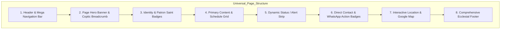
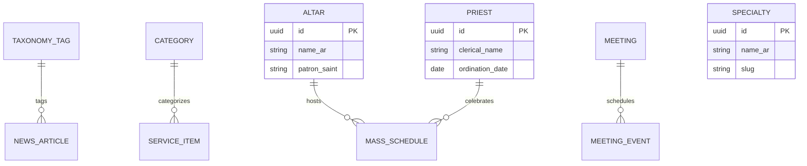

# وثيقة هندسة المعلومات وهيكل التصفح (Information Architecture & Site Taxonomy)
## البوابة الرقمية لكنيسة القديسين مكسيموس ودوماديوس والشهيد الأنبا موسى الأسود
**الإصدار:** 1.1.0 | **المعيار الهندسي:** Next.js 15 App Router Structure | **الاتجاه:** RTL-First

---

## 1. خريطة الموقع الهيكلية الشاملة (Full Sitemap & Route Tree)

```text
/ (الصفحة الرئيسية - نبض الكنيسة اليومي والموجز الحي)
│
├── /about/ (عن الكنيسة والمقدسات)
│   ├── /about/history (تاريخ الكنيسة والشفعاء والنشأة الروحية)
│   ├── /about/altars (المذابح الثلاثة والمزارات والتدشين)
│   └── /about/clergy (مجمع الآباء الكهنة وساعات المقابلات والاعترافات)
│
├── /masses/ (جداول القداسات الإلهية الأسبوعية وفلاتر المذابح)
│
├── /clinics/ (المستوصف الطبي التخصصي)
│   └── /clinics/specialties (دليل التخصصات والعيادات الـ 14)
│
├── /meetings/ (التربية الكنسية والاجتماعات النوعية - 11 قطاعات)
│   ├── /meetings/malaeika (اجتماع الملائكة - حضانة)
│   ├── /meetings/ebtedaey-1-3 (اجتماع ابتدائي صغار - 1 إلى 3)
│   ├── /meetings/ebtedaey-4-6 (اجتماع ابتدائي كبار - 4 إلى 6)
│   ├── /meetings/edaady (اجتماع المرحلة الإعدادية)
│   ├── /meetings/thanaway (اجتماع المرحلة الثانوية)
│   ├── /meetings/arshi-youth (أسرة شباب عرشي - جامعيين)
│   ├── /meetings/ni-angelos (اجتماع ني أنجيلوس - خريجين وموظفين)
│   ├── /meetings/holy-family (اجتماع الأسرة المقدسة - المتزوجين حديثاً)
│   ├── /meetings/men (اجتماع رجال القديس يوسف النجار)
│   ├── /meetings/om-elkhalas (اجتماع أم الخلاص - الأمهات والسيدات)
│   └── /meetings/widows-orphans (اجتماع الشهيد مارمينا والبابا كيرلس - كبار السن والأرامل)
│
├── /education/ (المدارس والمعاهد الكنسية والأكاديميات)
│   ├── /education/deacon-school (مدرسة القديس إستفانوس للشمامسة والتسجيل السنوي)
│   ├── /education/children-bible (مدرسة الكتاب المقدس للأطفال والمسابقات)
│   ├── /education/adult-bible (معهد الكتاب المقدس للكبار - 4 مراحل دراسية)
│   ├── /education/karouz-academy (معهد كاروز لإعداد وتأهيل الخدام)
│   └── /education/cithara-choir (مدرسة قيثارة التسابيح وكورال الكنيسة)
│
├── /activities/ (الأنشطة الرعوية والشبابية)
│   ├── /activities/scouts (فوج القديس الأنبا موسى للكشافة والمرشدات)
│   ├── /activities/lending-library (مكتبة الاستعارة العامة وفهرس الكتب)
│   ├── /activities/printing-center (مركز الطباعة والتصوير الرقمي للطلاب)
│   ├── /activities/creativity-center (مركز تنمية المواهب والإبداع والفنون)
│   ├── /activities/social-club (النادي الاجتماعي والرياضي والملاعب)
│   ├── /activities/computer-center (مركز التكنولوجيا والكمبيوتر والتحول الرقمي)
│   └── /activities/summer-club (النادي الصيفي السنوي وأنشطة الإجازة)
│
├── /services/ (المرافق والخدمات المجتمعية)
│   ├── /services/educational-center (المركز التعليمي وفصول التقوية المدرسية)
│   ├── /services/nursery (حضانة القديسين النموذجية للغات والرضع)
│   ├── /services/canteens (المقاصف والكانتين المركزي)
│   ├── /services/charitable-kitchen (المطبخ الخيري ومنفذ المحبة للأسر)
│   ├── /services/employment-office (مكتب التوظيف والتأهيل المهني)
│   ├── /services/membership-registry (مكتب السجل والشؤون الكنسية وإفادات المعمودية)
│   ├── /services/church-giftshop (مكتبة البيع والهدايا والأيقونات والصلبان)
│   └── /services/tailoring-workshop (مشغل ومعرض التفصيل والخياطة الكنسية)
│
├── /condolence/ (حجز قاعة العزاء والاستعلام ومتابعة الحجوزات)
├── /live/ (البث المباشر وصلوات المناسبات وأرشيف التسجيلات)
├── /bible/ (قارئ الكتاب المقدس القبطي الأرثوذكسي ومحرك البحث)
├── /donations/ (الحسابات البنكية الرسمية وقنوات المساهمة الشفافة)
└── /contact/ (الاتصال بالكنيسة والعنوان التفاعلي وخريطة الوصول)
```

---

## 2. تشريح هيكل الصفحة الموحد (Universal Page Layout Anatomy)

للحفاظ على الاتساق البصري والإدراكي وتيسير تجربة التصفح لكافة فئات شعب الكنيسة (خاصة كبار السن)، تتبع جميع صفحات الموقع قالباً معمارياً موحداً يتألف من 8 مكونات بنيوية:



### تفصيل مكونات القالب الموحد:

1. **الترويسة والشريط العلوي (Header & Mega Nav)**:
   - شريط علوي صغير: التاريخ الميلادي والقبطي اليومي، أوقات القداس القادم، ورابط التبرع السريع.
   - شريط التنقل الرئيسي: شعار الكنيسة المذهب، القائمة الرئيسية مع القوائم المنسدلة الضخمة (Mega Menus)، زر التبديل لحجم الخط (A / A+)، وأيقونة البحث.
2. **شريط البطل ومسار التتبع (Page Hero Banner & Breadcrumb)**:
   - خلفية وقورة بدرجات الأزرق الملوكي (`#1E2A78`) مدمجة بنمط أرابيسك قبطي خفيف.
   - عنوان الصفحة باللغة العربية الواضحة وبخط عريض، مع ترجمة باللغة الإنجليزية.
   - مسار التتبع الهرمي القابل للنقر (مثال: `الرئيسية > التربية الكنسية > أسرة شباب عرشي`).
3. **شارات الهوية والشفاعة (Identity & Patron Badges)**:
   - أيقونة قبطية معتمدة أو شارة طقسية توضح شفيع الخدمة (مثل: القديس مكسيموس، القديس دوماديوس، الشهيد الأنبا موسى الأسود، أو القديس ديديموس).
   - آية الإنجيل التي تمثل شعار الخدمة مكتوبة بالتشكيل وبخط قبطي عربي أصيل.
4. **منطقة المحتوى والشبكة التفاعلية (Primary Content & Schedule Cards)**:
   - عرض البيانات في بطاقات واضحة ذات حدود ناعمة وظلال خفيفة.
   - جداول المواعيد مقسمة بالأيام والساعات والأماكن بدقة.
5. **شريط التنبيهات ونبض الخدمة (Dynamic Status / Live Alert Strip)**:
   - مساحة مخصصة لأي مستجدات طارئة (تغيير موعد قداس، أو موعد بدء التسجيل).
6. **شارات الاتصال المباشر (Direct Contact & Deep Linking Badges)**:
   - زر مباشر لمراسلة مسؤول الخدمة أو حجز موعد عبر تطبيق واتساب بنقرة واحدة بدون حفظ الرقم.
   - زر الاتصال الهاتفي المباشر لخدمات الطوارئ وسكرتارية الكنيسة.
7. **الخريطة التفاعلية وموقع الخدمة (Location & Facility Map)**:
   - توضيح دقيق لمكان انعقاد الخدمة (الدور، رقم القاعة، المبنى) مع ويدجت خريطة تفاعلية مدعومة بـ OpenStreetMap / Google Maps للوصول للكنيسة.
8. **التذييل العام الشامل (Universal Ecclesial Footer)**:
   - روابط سريعة لكافة قطاعات الموقع، مواقيت الصلوات والقداسات الدورية، أرقام هواتف الآباء الكهنة، روابط المنصات الرسمية (YouTube, Facebook, Telegram)، وحقوق الطبع والنشر الكنسية.

---

## 3. مصفوفة المسارات والتوليد والمكونات (Route Matrix Table)

| # | المسار (Route URL) | العنوان باللغة العربية (Page Title) | استراتيجية التوليد (Rendering) | المكونات البرمجية الأساسية (Key Components) |
| :- | :--- | :--- | :--- | :--- |
| **01** | `/` | الرئيسية - نبض الكنيسة | **ISR (Revalidate: 60s)** | `HeroBanner`, `NextMassCountdown`, `WelcomeFromClergy`, `QuickServiceGrid`, `LatestNewsCarousel`, `BibleVerseDaily` |
| **02** | `/about/history` | تاريخ الكنيسة والشفعاء | **SSG (Static)** | `HistoryTimeline`, `PatronBiographies`, `PatriarchalVisits`, `HistoricalGallery` |
| **03** | `/about/altars` | المذابح الكنسية والمزارات | **SSG (Static)** | `AltarCardGrid`, `RelicShrineViewer`, `ConsecrationHistory`, `AltarScheduleBadge` |
| **04** | `/about/clergy` | مجمع الآباء الكهنة | **ISR (Revalidate: 3600s)** | `PriestProfileCard`, `OrdinationAnniversaryBadge`, `ConfessionSlots`, `WhatsAppPriestAction` |
| **05** | `/masses` | جداول القداسات الإلهية | **ISR (Revalidate: 300s)** | `MassScheduleTable`, `DayTabFilter`, `AltarSelectDropdown`, `FeastAlertBanner`, `PrintExportButton` |
| **06** | `/clinics` | المستوصف الطبي التخصصي | **ISR (Revalidate: 60s)** | `ClinicHero`, `SpecialtyBrowser`, `BookingInstructions` |
| **07** | `/clinics/specialties` | دليل التخصصات الطبية | **SSG (Static)** | `SpecialtyCard`, `RoomBadge`, `EquipmentShowcase` |
| **08** | `/meetings/malaeika` | اجتماع الملائكة (حضانة) | **SSG (Static)** | `MeetingHero`, `AgeCurriculumTimeline`, `HymnAudioSnippet`, `ParentWhatsAppLink` |
| **09** | `/meetings/ebtedaey-1-3` | اجتماع ابتدائي صغار | **SSG (Static)** | `ActivityCardGrid`, `WeeklyVerseBox`, `ServantsTeamBadge`, `MeetingScheduleCard` |
| **10** | `/meetings/ebtedaey-4-6` | اجتماع ابتدائي كبار | **SSG (Static)** | `BibleCompetitionCard`, `WeeklyLessonPlan`, `MeetingScheduleCard`, `AttendanceRewards` |
| **11** | `/meetings/edaady` | اجتماع المرحلة الإعدادية | **SSG (Static)** | `YouthHeroBanner`, `TopicDiscussionCard`, `YouthServantsList`, `TelegramChannelBtn` |
| **12** | `/meetings/thanaway` | اجتماع المرحلة الثانوية | **SSG (Static)** | `SpiritualGuidanceBox`, `WeeklyThemeCard`, `YouthRetreatGallery`, `ScheduleBadge` |
| **13** | `/meetings/arshi-youth` | أسرة شباب عرشي الجامعي | **ISR (Revalidate: 1800s)** | `UniversityYouthHero`, `SpiritualLecturesArchive`, `TripRegistrationCard`, `CommunityAction` |
| **14** | `/meetings/ni-angelos` | اجتماع ني أنجيلوس (خريجين) | **ISR (Revalidate: 1800s)** | `GraduatesHero`, `ProfessionalFellowship`, `CareerMentorship`, `MeetingTimeCard` |
| **15** | `/meetings/holy-family` | اجتماع الأسرة المقدسة | **SSG (Static)** | `FamilyCounselingCard`, `ParentingWorkshops`, `CouplesRetreatAnnouncement` |
| **16** | `/meetings/men` | اجتماع رجال القديس يوسف | **SSG (Static)** | `MenMeetingHero`, `SpiritualTalksSchedule`, `SocialCareProgram`, `ScheduleCard` |
| **17** | `/meetings/om-elkhalas` | اجتماع أم الخلاص للسيدات | **SSG (Static)** | `MothersHero`, `FamilyPrayerCard`, `WeeklyHomilyAudio`, `MeetingSchedule` |
| **18** | `/meetings/widows-orphans` | اجتماع مارمينا والبابا كيرلس | **SSG (Static)** | `CompassionServiceHero`, `AssistanceProgramDetails`, `ComfortTalksArchive` |
| **19** | `/education/deacon-school` | مدرسة القديس إستفانوس | **ISR (Revalidate: 300s)** | `DeaconLevelTabs`, `RegistrationCountdownTimer`, `HymnAudioPlayer`, `DeaconEnrollmentForm` |
| **20** | `/education/children-bible`| مدرسة الكتاب المقدس للأطفال | **SSG (Static)** | `InteractiveStoryTimeline`, `BibleQuizCard`, `ColoringDownloadBox` |
| **21** | `/education/adult-bible` | معهد الكتاب المقدس للكبار | **SSG (Static)** | `FourYearAcademicCurriculum`, `LectureScheduleTable`, `EnrollmentRequirements`, `StudyMaterials` |
| **22** | `/education/karouz-academy`| معهد كاروز لإعداد الخدام | **SSG (Static)** | `AcademySectionsGrid`, `AdmissionGuidelines`, `ServantPledgeCard`, `ApplicationDownload` |
| **23** | `/education/cithara-choir` | قيثارة التسابيح والكورال | **SSG (Static)** | `ChoirAudioShowcase`, `AuditionDatesCard`, `HymnTrackList`, `PerformancesGallery` |
| **24** | `/activities/scouts` | فوج الكشافة والمرشدات | **SSG (Static)** | `ScoutRanksHierarchy`, `CampPhotoGallery`, `ScoutRegistrationTerms`, `PatrolLeaderProfiles` |
| **25** | `/activities/lending-library`| مكتبة الاستعارة العامة | **ISR (Revalidate: 3600s)** | `BookCategoryFilter`, `CatalogSearchInput`, `BorrowingRulesModal`, `BookRecommendationCard` |
| **26** | `/activities/printing-center`| مركز الطباعة والتصوير | **SSG (Static)** | `ServicePriceTable`, `DocumentUploadPrompt`, `WorkingHoursBadge`, `DirectWhatsAppOrder` |
| **27** | `/activities/creativity-center`| مركز تنمية المواهب | **SSG (Static)** | `WorkshopCatalog`, `TalentExhibitionGallery`, `RegistrationFormModal` |
| **28** | `/activities/social-club` | النادي الاجتماعي والرياضي | **SSG (Static)** | `SportsFacilitySchedule`, `TournamentFixtures`, `ClubRulesCard`, `CoachProfiles` |
| **29** | `/activities/computer-center`| مركز التكنولوجيا والكمبيوتر | **SSG (Static)** | `CourseCatalogGrid`, `UpcomingWorkshops`, `CertificateAccreditation`, `EnrollAction` |
| **30** | `/activities/summer-club` | النادي الصيفي السنوي | **ISR (Revalidate: 1800s)** | `SummerProgramHero`, `DailyActivitiesAgenda`, `SummerPricingCard`, `OnlineRegistrationBtn` |
| **31** | `/services/educational-center`| المركز التعليمي الدراسي | **SSG (Static)** | `TutoringScheduleByGrade`, `TeacherDirectory`, `CenterAdmissionPolicy` |
| **32** | `/services/nursery` | حضانة القديسين النموذجية | **SSG (Static)** | `NurseryInfantProgram`, `PreSchoolCurriculum`, `DailyMealSchedule`, `NurseryTourModal` |
| **33** | `/services/canteens` | المقاصف والكانتين | **SSG (Static)** | `MenuDisplayCard`, `HygieneCertificationBadge`, `ServiceHoursCard` |
| **34** | `/services/charitable-kitchen`| المطبخ الخيري ومنفذ المحبة | **SSG (Static)** | `CharityMissionHero`, `FoodDriveSchedule`, `VolunteerSignUpCard`, `PackagingGuidelines` |
| **35** | `/services/employment-office`| مكتب التوظيف والتأهيل | **ISR (Revalidate: 600s)** | `JobVacanciesList`, `ResumeSubmissionForm`, `EmployerPartnersLogoGrid` |
| **36** | `/services/membership-registry`| مكتب السجل والشؤون الكنسية| **SSG (Static)** | `CertificateIssuanceGuide`, `RequiredDocumentsChecklist`, `OfficeHoursCard` |
| **37** | `/services/church-giftshop` | مكتبة البيع والهدايا | **SSG (Static)** | `ProductCategoryShowcase`, `FeaturedIconsGrid`, `GiftshopHoursBadge` |
| **38** | `/services/tailoring-workshop`| مشغل وتفصيل الملابس الكنسية| **SSG (Static)** | `VestmentCatalogGrid`, `TailoringOrderForm`, `FabricShowcaseCard` |
| **39** | `/condolence` | حجز قاعة العزاء | **SSR / Edge Form** | `CondolenceBookingForm`, `AvailabilityCalendar`, `RulesAccordion`, `ReservationTrackingCard` |
| **40** | `/live` | البث المباشر والصلوات | **SSR / Edge Live** | `LiveStreamPlayer`, `ActiveStreamStatusBadge`, `UpcomingStreamsTimeline`, `YouTubeSubscription` |
| **41** | `/bible` | قارئ الكتاب المقدس | **Client-Side SPA** | `TestamentSelector`, `BookNavigator`, `ChapterViewer`, `FulltextBibleSearch`, `FontResizer` |
| **42** | `/donations` | التبرعات والحسابات البنكية | **SSG (Static)** | `OfficialBankCard`, `IbanCopyWidget`, `DonationPurposeBreakdown`, `TransparencyNotice` |
| **43** | `/contact` | الاتصال والعنوان | **SSG (Static)** | `ContactForm`, `EmergencyClergyPhoneGrid`, `GoogleMapsInteractive`, `SocialLinksRow` |

---

## 4. نموذج وهيكلية البيانات الوصفية والتصنيف (Content Model & Taxonomy)



### وسوم التصنيف المشتركة (Common Taxonomy Tags):
- **وسوم المراحل العمرية (Target Age Tags)**: `طفولة_مبكرة`, `ابتدائي`, `إعدادي`, `ثانوي`, `جامعيين`, `خريجين`, `أسر_شابة`, `كبار_السن`.
- **وسوم الطقس والمناسبات (Liturgical Tags)**: `قداس_إلهي`, `عشية_وتسبحة`, `أسبوع_الآلام`, `صوم_كبير`, `صوم_العذراء`, `عيد_سيدي`.
- **وسوم الخدمات المجتمعية (Service Tags)**: `عيادات_طبية`, `رعاية_اجتماعية`, `تعليم_وتثقيف`, `كشافة_ورياضة`, `خدمة_أرامل`.

---

## 5. هيكلية القوائم وتجربة التصفح (Navigation Hierarchy)

### 5.1 القائمة الممتدة لسطح المكتب (Desktop Mega-Menu)
تتوزع القائمة الرئيسية أفقياً إلى 8 بوابات رئيسية، تعرض كل بوابة منها قائمة عملاقة (Mega Menu) عند التمرير:
1. **الرئيسية (`/`)**: العودة لنبض الكنيسة وموجز اليوم.
2. **عن الكنيسة**: تفرعات (التاريخ والنشأة، المذابح المقدسة، مجمع الآباء الكهنة).
3. **القداسات (`/masses`)**: مواعيد القداسات، الصلوات الطقسية، أعياد الكنيسة.
4. **العيادات الطبية**: تفرعات (دليل التخصصات، مواعيد المعمل والصيدلية).
5. **التربية الكنسية**: تفرعات (الملائكة، ابتدائي، إعدادي، ثانوي، شباب عرشي، ني أنجيلوس، الأسرة المقدسة، الرجال، السيدات، الرعاية).
6. **المدارس والأكاديميات**: تفرعات (مدرسة الشمامسة، مدرسة الكتاب المقدس، معهد الكتاب المقدس للكبار، معهد كاروز لإعداد الخدام، قيثارة التسابيح والكورال).
7. **الأنشطة والخدمات**: تفرعات (الكشافة، النادي الرياضي، الحضانة، فصول التقوية، المطبخ الخيري، مشغل الملابس الكنسية).
8. **تواصل وحجز**: تفرعات (حجز قاعة العزاء، البث المباشر، التبرعات الرسمية، اتصل بنا).

### 5.2 القائمة الجانبية المخصصة للهواتف (Mobile Drawer & Quick Action Bar)
- **شريط الوصول السريع السفلي المثبت (Bottom Floating Action Bar)**:
  - أيقونة القداسات (الوصول بلمسة واحدة لجدول اليوم).
  - أيقونة العيادات (الوصول السريع لدليل التخصصات والعيادات).
  - أيقونة البث المباشر (تنبض باللون الأحمر عند تشغيل بث حي).
  - زر القائمة الكاملة (Hamburger Drawer) لاستعراض كافة الفروع الـ 35+ بكل سلاسة.

---
**انتهت وثيقة هندسة المعلومات وتصميم المسارات - جاهزة للتنفيذ البرمجي.**
