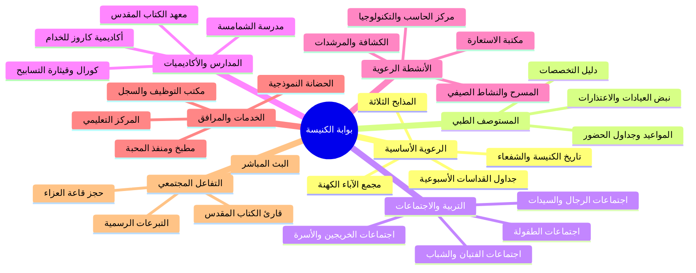

# وثيقة متطلبات المنتج الكاملة (Product Requirements Document - PRD)
## البوابة الرقمية لكنيسة القديسين مكسيموس ودوماديوس والشهيد العظيم الأنبا موسى الأسود
**الإصدار:** 1.1.0 | **الحالة:** معتمد للتنفيذ البرمجي (بعد مصالحة v1.1) | **التاريخ:** سبتمبر 2026

---

## 1. الرؤية والرسالة والأهداف الاستراتيجية (Executive Vision & Objectives)

### 1.1 الرؤية (Vision)
تأسيس البوابة الرقمية الرسمية الأكثر كفاءة وسرعة وسهولة في الكنيسة القبطية الأرثوذكسية، لتكون واجهة رعوية وخدمية مفتوحة وشاملة تعكس التاريخ الكنسي العريق والنشاط الروحي والاجتماعي الحي لكنيسة القديسين مكسيموس ودوماديوس والشهيد الأنبا موسى الأسود، مقتدية بأعلى معايير الإتاحة الرقمية وتجربة المستخدم الحديثة.

### 1.2 الرسالة (Mission)
إتاحة كافة مواعيد الأسرار الكنسية، جداول القداسات الإلهية، خدمات المستوصف الطبي التخصصي، مواعيد التربية الكنسية والمدارس الأكاديمية، والخدمات المجتمعية لكل مخدوم وزائر في أي وقت ومن أي جهاز، بدون عوائق تسجيل الدخول أو التعقيدات التقنية، مع الحفاظ على أعلى درجات الشفافية والوقار القبطي الأرثوذكسي.

### 1.3 الأهداف الاستراتيجية القابلة للقياس (Key Performance Indicators)
1. **سرعة الوصول القصوى**: الوصول لأي معلومة حيوية (موعد قداس، تخصص طبيب، اعتذار عيادة) خلال أقل من 3 نقرات أو أقل من 5 ثوانٍ من الصفحة الرئيسية.
2. **الاستغناء الكامل عن المطبوعات الورقية المعرضة للتلف أو التغيير**: استبدال لوحات الإعلانات الورقية وجداول الأطباء المطبوعة بلوحة رقمية حية يتم تحديثها لحظياً.
3. **صفر ارتباك لمرضى العيادات**: خفض حالات ذهاب المرضى إلى العيادة أثناء اعتذار الطبيب إلى أقل من 5% (تُقاس بمسح ربع سنوي لدوافع الحضور المسجلة عند شباك التذاكر) من خلال نظام "نبض العيادات اللحظي".
4. **الوصول الشامل للمسنين والمغتربين**: ضمان توافق كامل مع هواتف كبار السن ومتصفحات المغتربين بجودة أداء تتجاوز 95 نقطة على مؤشر Google Lighthouse.

---

## 2. دراسة الجمهور المستهدف ورحلات المستخدمين (Target Personas & User Journeys)

### 2.1 الشخصيات المستهدفة (Target Personas)

#### شخصية 1: عم ماريو (المسن المواظب - 68 عاماً)
- **الخلفية**: متقاعد، يعاني من ضعف نسبي في الإبصار، يستخدم هاتف أندرويد اقتصادي من خلال باقة إنترنت محدودة.
- **الهدف**: معرفة موعد قداس الفجر في مذبح الأنبا موسى ليوم الأربعاء، ومتابعة البث المباشر لعشية السبت في حال عدم قدرته الصحية على الذهاب.
- **التحدي**: يتشتت بالخطوط الصغيرة والقوائم المنسدلة المعقدة، ولا يحفظ كلمات مرور.

#### شخصية 2: مدام مريم (الأم ومديرة الأسرة - 39 عاماً)
- **الخلفية**: موظفة وأم لطفلين (في ابتدائي وإعدادي)، مسؤولة عن مواعيد دروسهم ومدارس الأحد وصحتهم.
- **الهدف**: حجز كشف أطفال في عيادة الكنيسة والتأكد هل طبيب العظام معتذر اليوم أم متواجد، ومعرفة موعد اجتماع ابتدائي وموعد امتحان مدرسة الشمامسة لابنها.
- **التحدي**: وقتها ضيق جداً وتحتاج روابط مباشرة للتواصل عبر الواتساب مع سكرتارية الخدمة.

#### شخصية 3: مايكل (شاب جامعي وخادم مبتدئ - 21 عاماً)
- **الخلفية**: طالب بكلية الهندسة، ملتحق بأسرة عرشي للشباب الجامعي ومعهد كاروز لإعداد الخدام.
- **الهدف**: تحميل جدول محاضرات معهد إعداد الخدام، مراجعة قراءات الكتاب المقدس، والتسجيل في نشاط الكشافة الصيفي.
- **التحدي**: يفضل التصفح الليلي المريح وسرعة التفاعل الفائقة عبر الموبايل.

#### شخصية 4: دكتور بيتر (استشاري متطوع في العيادات - 48 عاماً)
- **الخلفية**: استشاري باطنة وجهاز هضمي، يقدم عيادة أسبوعية في مستوصف الكنيسة مساء كل ثلاثاء.
- **الهدف**: إبلاغ إدارة المستوصف باعتذاره عن عيادة الغد لوجود مؤتمر طبي طارئ، ورؤية انعكاس ذلك فوراً على الموقع لحفظ وقت المرضى.
- **التحدي**: لا يملك وقتاً لكتابة تقارير مطولة، يحتاج فقط زر تبديل أو إرسال إشعار فوري لمسؤول النظام.

#### شخصية 5: جورج (مغترب في كندا - 34 عاماً)
- **الخلفية**: هاجر منذ 5 سنوات من الإسكندرية ومرتبط وجدانياً بكنيسته الأم كنيسة مكسيموس ودوماديوس والأنبا موسى.
- **الهدف**: متابعة بث قداسات الأعياد مباشرة، التبرع لحساب إخوة الرب والحساب الجاري للكنيسة، وإرسال أسماء لترحيل الراقدين وصلوات التجنيز.
- **التحدي**: فارق التوقيت وصعوبة الاتصال الهاتفي الدولي، يحتاج بيانات الحسابات البنكية الرسمية الرسمية (IBAN/SWIFT) بدقة.

#### شخصية 6: الأستاذ عادل (مسؤول سكرتارية الكنيسة والنظام - 45 عاماً)
- **الخلفية**: أمين الخدمة الإدارية بالكنيسة ومسؤول التواصل المجتمعي.
- **الهدف**: تحديث جدول مواعيد القداسات لعيد الميلاد القادم، تأكيد حجز قاعة العزاء للمتوفين، وتحديث لوحة اعتذارات الأطباء.
- **التحدي**: يحتاج لوحة تحكم إدارية واضحة وبسيطة لا تتطلب معرفة برمجية.

---

## 3. المتطلبات الوظيفية التفصيلية لكافة صفحات وقطاعات الموقع (Functional Requirements)

تم حصر وتصنيف أكثر من 35 مساراً وصفحة رئيسية وفرعية تغطي البنية الكاملة للخدمة الكنسية استناداً للمعيار المرجعي:

---

### 3.1 القطاع الأول: الرعوية الأساسية وهوية الكنيسة (Core Parish Sector)

#### 3.1.1 صفحة تاريخ الكنيسة والنشأة والشفعاء (`/about/history`)
- **الهدف الوظيفي**: توثيق النشأة الروحية والمعمارية لكنيسة القديسين مكسيموس ودوماديوس والأنبا موسى الأسود.
- **العناصر الإلزامية**:
  - قصة حياة القديسين مكسيموس ودوماديوس أميري الروم ورهبنتهما في برية شيهيت تحت إرشاد القديس مقاريوس الكبير.
  - سيرة القديس القوي الشهيد الأنبا موسى الأسود، رمز التوبة والقوة الروحية في الرهبنة القبطية.
  - الجدول الزمني لتأسيس الكنيسة، وضع حجر الأساس، الزيارات البابوية الرعوية (قداسة البابا شنودة الثالث وقداسة البابا تواضروس الثاني).
  - معرض صور تاريخي بتقنية العرض التفاعلي مع ميزة التكبير والوصف التوثيقي.

#### 3.1.2 صفحة المذابح وتدشينها (`/about/altars`)
- **المحتوى الفني**:
  1. **المذبح الرئيسي الأوسط**: باسم القديسين مكسيموس ودوماديوس (حامل الأيقونات الرخامي، أيقونة الحضن الأبوي، تاريخ التدشين).
  2. **المذبح البحري**: باسم الشهيد القديس الأنبا موسى الأسود ومرفق به مزار رفاته المقدسة وبركته.
  3. **المذبح القبلي**: باسم والدة الإله القديسة العذراء مريم والشهيد العظيم مارجرجس الروماني.
- **الميزات التفاعلية**:
  - عرض المواعيد الدورية لإقامة القداسات على كل مذبح.
  - أوقات التبرك بمزار القديسين والأيام الاحتفالية السنوية لكل مذبح.

#### 3.1.3 صفحة مجمع الآباء الكهنة الموقرين (`/about/clergy`)
- **المحتوى الفني**:
  - بطاقة شخصية موحدة لكل أب كاهن تشمل:
    - الاسم الكهنوتي المقدس (مثال: القس / القمص ...).
    - تاريخ الرسامة الكهنوتية، وتاريخ نوال رتبة القمصية (إن وجدت).
    - أعياد الشفاعة والرعاية الشخصية.
    - قطاع المسؤولية الرعوية والخدمية داخل الكنيسة (شؤون التربية الكنسية، العيادات، العلاقات العامة، سكرتارية الافتقاد).
    - ساعات وأيام التواجد الرسمية في الكنيسة لجلسات الاعتراف والمقابلات الرعوية.
    - رابط مراسلة مباشر مع سكرتارية الأب الكاهن عبر تطبيق واتساب لطلب المقابلات دون إحراج.

#### 3.1.4 صفحة الجداول الأسبوعية للقداسات الإلهية (`/masses`)
- **المتطلبات الوظيفية**:
  - عرض أسبوعي كامل ومقسم بدقة لجميع القداسات (الأحد، الإثنين، الثلاثاء، الأربعاء، الخميس، الجمعة، السبت).
  - تقسيم فترات القداسات:
    - قداس الفجر الباكر (مثلاً من 5:30 ص إلى 7:30 ص).
    - القداس الصباحي الأول (من 7:00 ص إلى 9:00 ص).
    - القداس الصباحي الثاني المتأخر (من 8:30 ص إلى 11:00 ص).
  - توضيح المذبح الذي يقام عليه كل قداس واسم الكاهن أو الدورة الرعوية القائمة بالخدمة.
  - شريط تنبيهي خاص بأصوام الكنيسة ومواسم الأعياد (أسبوع الآلام، صوم الرسل، صوم العذراء، صوم الميلاد).
  - أداة تصفية (Filter) تفاعلية حسب: اليوم، المذبح، الفترة الزمنية (صباحي / مسائي).
  - ميزة التصدير والطباعة (Print Optimized View / PDF Download) للأسر والمسنين.

---

### 3.2 القطاع الثاني: المستوصف الطبي والعيادات التخصصية (`/clinics`)

يعتبر مستوصف كنيسة القديسين مكسيموس ودوماديوس والأنبا موسى الأسود صرحاً طبياً يقدم الرعاية التخصصية لآلاف الأسر شهرياً بتكلفة رمزية.

#### 3.2.1 دليل التخصصات الطبية (`/clinics/specialties`)
- تغطية ما لا يقل عن 14 تخصصاً طبياً رئيسياً:
  1. الباطنة العامة والجهاز الهضمي والكبد.
  2. طب الأطفال وحديثي الولادة ورعاية المبتسرين.
  3. جراحة العظام والمفاصل والعمود الفقري.
  4. الجراحة العامة وجراحة الأورام والمناظير.
  5. النساء والتوليد ومتابعة الحمل الحرج.
  6. طب وجراحة الأسنان وجراحة الوجه والفكين.
  7. طب وجراحة العيون والرمد وتصحيح الإبصار.
  8. الأنف والأذن والحنجرة ومقاييس السمع.
  9. الأمراض الجلدية والتناسلية والعلاج بالليزر.
  10. العلاج الطبيعي والتأهيل الحركي وروماتيزم المفاصل.
  11. أمراض القلب والأوعية الدموية والقسطرة ورسم القلب.
  12. الأمراض العصبية والطب النفسي وعلاج الإدمان.
  13. المعمل الطبي التحليلي الشامل (مفتوح طوال اليوم).
  14. الصيدلية الخيرية وصرف الأدوية المزمنة.

#### 3.2.2 نظام نبض العيادات والاعتذارات اللحظية (`/clinics/status` أو شريط التنبيهات)
- **أهم ميزة تشغيلية**:
  - عرض شريط مباشر ملون أعلى صفحة العيادات:
    - **أخضر (يعمل بانتظام)**: الطبيب متواجد وفق جدوله المعتمد.
    - **أحمر وماضٍ (اعتذار اليوم)**: "يعتذر أ.د. [الاسم] عن عيادة [التخصص] اليوم [التاريخ] لظرف طارئ".
  - أرشيف اعتذارات لمدة 48 ساعة لمنع تضارب المواعيد.
  - إمكانية اشتراك المريض في تنبيه واتساب للعيادة المعنية.

---

### 3.3 القطاع الثالث: التربية الكنسية والاجتماعات النوعية (11 اجتماعاً متخصصاً)

تم تقسيم خدمات التربية الكنسية إلى 11 قطاعاً عمرية ونوعية دقيقة، لكل منها صفحته المستقلة التي تشمل (الرؤية، الشعار الكنسي والآية، الموعد الأسبوعي، مكان الانعقاد، أمين الخدمة، وروابط الأنشطة):

| الرقم | اسم الاجتماع | الفئة المستهدفة | الموعد الأسبوعي المعتمد | مكان الانعقاد في الكنيسة |
| :--- | :--- | :--- | :--- | :--- |
| **01** | **اجتماع الملائكة** (`/meetings/malaeika`) | حضانة (KG1 & KG2) | الجمعة 8:30 ص - 10:30 ص | قاعات مبنى الخدمات - الدور الثاني |
| **02** | **اجتماع ابتدائي صغار** (`/meetings/ebtedaey-1-3`) | المرحلة الابتدائية (1 و 2 و 3) | الجمعة 10:30 ص - 12:30 ظ | القاعة الكبرى للقديس مكسيموس |
| **03** | **اجتماع ابتدائي كبار** (`/meetings/ebtedaey-4-6`) | المرحلة الابتدائية (4 و 5 و 6) | الجمعة 10:30 ص - 12:30 ظ | قاعة الشهيد الأنبا موسى الأسود |
| **04** | **اجتماع إعدادي** (`/meetings/edaady`) | بنين وبنات المرحلة الإعدادية | الخميس 6:00 م - 8:00 م | مسرح الكنيسة الرئيسي |
| **05** | **اجتماع ثانوي** (`/meetings/thanaway`) | شباب وشابات المرحلة الثانوية | الجمعة 6:30 م - 8:30 م | القاعة الكبرى للقديسين |
| **06** | **أسرة شباب عرشي** (`/meetings/arshi-youth`) | طلبة وطالبات الجامعات والمعاهد | الأحد 7:00 م - 9:00 م | مسرح الكنيسة الرئيسي |
| **07** | **اجتماع ني أنجيلوس** (`/meetings/ni-angelos`) | الخريجون والموظفون وأصحاب المهن | السبت 7:30 م - 9:30 م | قاعة المؤتمرات - الدور الرابع |
| **08** | **اجتماع الأسرة المقدسة** (`/meetings/holy-family`) | المقبلون على الزواج والأسر الشابة | الأربعاء 7:00 م - 9:00 م | صحن الكنيسة الرئيسي |
| **09** | **اجتماع رجال القديس يوسف** (`/meetings/men`) | الرجال وأرباب الأسر وكبار السن | الثلاثاء 6:30 م - 8:30 م | قاعة الشهيد الأنبا موسى |
| **10** | **اجتماع أم الخلاص** (`/meetings/om-elkhalas`) | الأمهات والسيدات وربات البيوت | الإثنين 10:00 ص - 12:00 ظ | صحن الكنيسة الرئيسي |
| **11** | **اجتماع مارمينا والبابا كيرلس** (`/meetings/widows-orphans`) | الأرامل، كبار السن المعيلين، وذوي الهمم | الأربعاء 10:00 ص - 12:00 ظ | القاعة الأرضية المهيأة للكراسي المتحركة |

---

### 3.4 القطاع الرابع: المدارس والمعاهد الكنسية والأكاديميات (`/education`)

#### 3.4.1 مدرسة القديس إستفانوس للشمامسة (`/education/deacon-school`)
- **نظام الدراسة**:
  - مستويات متدرجة (مستوى تمهيدي للأطفال، مستوى إبصالتوس، مستوى أغنسطس، مستوى إيبودياكون).
  - دراسة طقس القداسات الباسيلية والغريغورية والكيرلسية، مردات الشماس، وقواعد الترتيل القبطي السليم.
- **ميزة العد التنازلي للتسجيل (Registration Countdown Timer)**:
  - مؤقت رقمي حي يوضح الأيام والساعات المتبقية حتى فتح باب التقديم السنوي.
  - استمارة تسجيل إلكترونية تطلب: اسم الشماس، تاريخ الميلاد، المرحلة الدراسية، الأب المعترف، والمستوى المراد الالتحاق به.

#### 3.4.2 مدرسة الكتاب المقدس للأطفال (`/education/children-bible`)
- تبسيط أسفار الكتاب المقدس وقصص الآباء والأنبياء عبر الوسائط التفاعلية والرسوم المتحركة والمسابقات الذهنية الأسبوعية.

#### 3.4.3 معهد القديس ديديموس الضرير لدراسات الكتاب المقدس للكبار (`/education/adult-bible`)
- برنامج أكاديمي منظم يمتد على **4 مراحل دراسية**:
  - **السنة الأولى (التمهيدية)**: مدخل عام لعلم التفسير، تاريخ تدوين الأسفار، والمخطوطات القبطية.
  - **السنة الثانية**: أسفار الشريعة والأسفار التاريخية وأسفار الحكمة والشعر.
  - **السنة الثالثة**: الأنبياء الكبار والصغار وتاريخ العهد الجديد والأناجيل الإزائية.
  - **السنة الرابعة (الدبلوم)**: رسائل بولس الرسول، سفر الرؤيا، واللاهوت الدفاعي المرتكز على كلمة الله.
- متطلبات التخرج والأبحاث وسجل المحاضرات الصوتية المسجلة.

#### 3.4.4 معهد كاروز لإعداد الخدام (`/education/karouz-academy`)
- تأهيل الخدام روحياً ونفسياً وتربوياً وطقسياً عبر أقسام متخصصة:
  - قسم خدام الطفولة والابتكارات.
  - قسم خدام الفتيان والشباب والإرشاد النفسي لمرحلة المراهقة.
  - قسم الرعاية والافتقاد الاجتماعي.
  - شروط القبول والتزكية من الأب المعترف ولائحة المواظبة السنوية.

#### 3.4.5 مدرسة قيثارة التسابيح وكورال الكنيسة (`/education/cithara-choir`)
- تدريب الأصوات، الصولفيج الموسيقي الكنسي، مرافقة الدف والمثلث، تسجيلات الترانيم التراثية القبطية، وإعداد الاحتفالات السنوية في الأعياد الباتريركية.

---

### 3.5 القطاع الخامس: الأنشطة الرعوية والشبابية (`/activities`)

1. **فوج القديس الأنبا موسى للكشافة والمرشدات (`/activities/scouts`)**:
   - فرق الأشبال، الكشافة، الجوالة، الزهرات، والمرشدات.
   - اللائحة الانضباطية، المعسكرات الصيفية والشتوية، ومهارات البقاء في الخلاء وخدمة المجتمع السكندري.
2. **مكتبة الاستعارة العامة والاطلاع (`/activities/lending-library`)**:
   - فهرس إلكتروني مبسط لتصنيف الكتب (آبائيات، تفاسير، تاريخ كنسي، سير قديسين، روايات هادفة، كتب أسرية).
   - قواعد استعارة الكتب (حد أقصى كتابين لمدة أسبوعين مجاناً لكل مخدوم).
3. **مركز الطباعة والتصوير الرقمي (`/activities/printing-center`)**:
   - دعم الطلاب بأعمال التصوير وتجليد الملازم الدراسية وطباعة أبحاث التخرج بأسعار دعم رمزي.
4. **مركز تنمية المواهب والإبداع (`/activities/creativity-center`)**:
   - ورش الرسم الكنسي والأيقونات، العزف الموسيقي، الخط العربي، الشطرنج، وفنون الإلقاء والشعر.
5. **النادي الاجتماعي والرياضي (`/activities/social-club`)**:
   - ملاعب الكنيسة ودوريات كرة القدم الدورية وتنس الطاولة والبلياردو وصالات اللياقة البدنية تحت إشراف خدام رياضيين.
6. **مركز التكنولوجيا والكمبيوتر (`/activities/computer-center`)**:
   - دورات محو الأمية الرقمية لكبار السن، ودورات البرمجة والذكاء الاصطناعي والتصميم الجرافيكي للنشء والشباب.
7. **النادي الصيفي السنوي (Summer Club) (`/activities/summer-club`)**:
   - برنامج ترفيهي وتعليمي يومي مكثف خلال العطلة الصيفية يخدم أكثر من 500 طفل من أبناء الحي.

---

### 3.6 القطاع السادس: المرافق والخدمات المجتمعية (`/services`)

1. **المركز التعليمي وفصول التقوية (`/services/educational-center`)**:
   - نخبة من أفضل المدرسين المتطوعين لدعم طلاب الشهادات العامة (الإعدادية والثانوية العامة) بمبالغ رمزية لمحاربة الدروس الخصوصية الجشعة.
2. **حضانة القديسين النموذجية للغات (`/services/nursery`)**:
   - قسم الرضع (من سن 3 شهور)، وقسم رياض الأطفال التمهيدي، بإشراف تربوي وطبي متكامل ووجبات صحية طازجة.
3. **المقاصف والكانتين المركزي (`/services/canteens`)**:
   - توفير المأكولات والمشروبات الساخنة والباردة والمخبوزات الطازجة لشعب الكنيسة والخدام بين القداسات والخدمات.
4. **المطبخ الخيري ومنفذ المحبة (`/services/charitable-kitchen`)**:
   - تجهيز مئات الوجبات الساخنة الطازجة أسبوعياً لتوزيعها في سرية وكرامة تامة على الأسر الأولى بالرعاية والمغتربين.
5. **مكتب التوظيف والتأهيل المهني (`/services/employment-office`)**:
   - ملتقى توظيفي مجاني يستقبل السير الذاتية لأبناء الكنيسة ويربطهم بفرص العمل الشاغرة في شركات ومصانع رجال الأعمال الوطنيين والمحليين.
6. **مكتب السجل والشؤون الكنسية (`/services/membership-registry`)**:
   - استخراج وتوثيق إفادات المعمودية، شواهد الزواج والخطوبة، وإجراءات توثيق الأحوال الشخصية القبطية.
7. **مكتبة الهدايا والكتب المسيحية (`/services/church-giftshop`)**:
   - بيع الهدايا الدينية، الصلبان الخشبية والفضية، البخور الفاخر، الشموع، والأيقونات المدشنة.
8. **مشغل ومعرض التفصيل والخياطة الكنسية (`/services/tailoring-workshop`)**:
   - تفصيل وخياطة ملابس الخدمة والشمامسة (التونية والبطرشيل والزنار)، ومفارش المذابح والأغطية الطقسية وفق التراث القبطي.

---

### 3.7 القطاع السابع: التفاعل المجتمعي والنماذج الحيوية (Interactive Community Modules)

#### 3.7.1 منظومة حجز قاعة العزاء والمناسبات (`/condolence`)
- **الأهمية الرعوية**: تجنيب الأسرة المفجوعة عناء الاتصالات المتكررة في أحلك أوقات الحزن.
- **مسار حجز القاعة (Booking Workflow)**:
  1. إدخال اسم المتوفى بالكامل وموعد الجناز المقترح.
  2. تحديد موعد وتوقيت سرادق العزاء (فترة مسائية من 6:00 م حتى 10:00 م).
  3. إدخال بيانات صاحب الحجز (صلة القرابة، الاسم، رقم الهاتف المحمول، العنوان).
  4. استعراض تعليمات وقواعد القاعة المقررة كنسياً (منع التدخين، الهدوء الوقور، عدم إحضار مصورين خارجيين بدون ترخيص).
  5. إصدار كود حجز فوري مع رسالة تأكيد عبر واتساب وسجل معلق في لوحة تحكم السكرتارية للموافقة والتنسيق الفوري.

#### 3.7.2 البث المباشر وصلوات المناسبات (`/live`)
- **المتطلبات التقنية**:
  - مشغل فيديو مدمج متجاوب متصل بالقناة الرسمية للكنيسة على YouTube.
  - إشعار ديناميكي عند بدء البث المباشر الفعلي ("تبث الكنيسة الآن: صلوات القداس الإلهي / العشية").
  - جدول مواعيد البث المباشر الأسبوعي مع أرشيف مصنف للصلوات السابقة واللقاءات الروحية.

#### 3.7.3 قارئ ومحرك بحث الكتاب المقدس القبطي الأرثوذكسي (`/bible`)
- **المتطلبات الوظيفية**:
  - فهرس كامل لأسفار العهد القديم (46 سفراً وفق الكانون القبطي الأرثوذكسي، شاملة الأسفار القانونية الثانية) (توبيا، يهوديت، المكابيين، الحكمة، يشوع بن سيراخ، باروخ، وتتمات دانيال وإستير)، وأسفار العهد الجديد (27 سفراً).
  - إمكانية القراءة الآية بآية مع تدرج حجم الخط، وحفظ موضع القراءة في التخزين المحلي (LocalStorage).
  - محرك بحث نصي فوري داخل آيات الكتاب المقدس يدعم مطابقة الجذور العربية والتجاهل الذكي للألفات والياءات (أ، إ، آ، ا / ي، ى).

#### 3.7.4 بيانات التبرعات والحسابات البنكية الرسمية (`/donations`)
- **المعايير والضوابط الرعوية**:
  - عرض حسابات البنوك المصرية الرسمية المعتمدة باسم الكنيسة (البنك الأهلي المصري، بنك مصر، بنك CIB).
  - توضيح أرقام الحسابات، رقم الآيبان الدولي (IBAN)، والرمز البنكي (SWIFT BIC).
  - تقسيم بنود التبرعات بوضوح تام: (حساب العيادات والأجهزة الطبية، حساب إخوة الرب والمحتاجين، حساب عمارة الكنيسة ومبنى الخدمات).
  - التنويه الصريح بعدم جمع تبرعات نقدية عبر أشخاص أو بوابات غير مسجلة كنسياً لحماية شعب الكنيسة.

---

## 4. المتطلبات غير الوظيفية ومحددات الجودة (Non-Functional Requirements)

### 4.1 الأداء والسرعة (Performance & Speed)
- **مؤشرات Core Web Vitals المستهدفة**:
  - Largest Contentful Paint (LCP) < 1.2 ثانية.
  - Time to First Byte (TTFB) < 200 مللي ثانية على شبكات Vercel Edge.
  - Cumulative Layout Shift (CLS) = 0.00.
  - Total Blocking Time (TBT) < 100 مللي ثانية.
- تحسين كامل للصور عبر تنسيقات حديثة (Next/Image مع تحويل تلقائي إلى WebP/AVIF).

### 4.2 إمكانية الوصول وسهولة الاستخدام لكبار السن (Accessibility & Senior Friendly - A11y)
- مطابقة معايير **WCAG 2.1 Level AA**.
- دعم مبدل حجم الخط (تكبير النصوص بنقرة زر لكبار السن: A / A+ / A++).
- تباين لوني فائق بين النصوص والخلفيات لا يقل عن 4.5:1 للمحتوى العادي و7:1 للعناوين الرئيسية.
- إمكانية التنقل التام عبر لوحة المفاتيح (Keyboard Accessible) للمستخدمين ذوي الإعاقات الحركية.

### 4.3 التوافق مع الهواتف المحمولة والشبكات الضعيفة (Mobile-First & Resiliency)
- واجهة مصممة أصيلاً لتلائم شاشات الهواتف المحمولة (320px وحتى شاشات 4K).
- سلوك سلس في حال انقطاع الشبكة الجزئي، مع كاش محلي للبيانات المزارة مؤخراً (Offline-Friendly Caching).
- أزرار تفاعلية بحجم لمس مريح (Touch Target لا يقل عن 48x48 بكسل).

### 4.4 معايير تحسين محركات البحث والأرشفة الدينية (SEO & Structured Data)
- بيانات وصفية شاملة لكل صفحة (Title, Meta Description, Canonical URLs, OpenGraph Tags).
- تضمين مخططات بيانات مدمجة (Schema.org JSON-LD) تتوافق مع:
  - `Church` / `PlaceOfWorship`
  - `MedicalClinic` / `Physician`
  - `Event` للقداسات والاجتماعات السنوية
  - `BroadcastService` للبث المباشر
- ملفات `sitemap.xml` و `robots.txt` يتم توليدها برمجياً وتحديثها فورياً عند نشر أي محتوى جديد.

### 4.5 الأمان والخصوصية (Security & Data Protection)
- تشفير كامل للاتصالات عبر بروتوكول HTTPS الإلزامي مع شهادات SSL HSTS.
- تطبيق نمط سياسات أمان المتصفح (Content Security Policy - CSP) لمنع هجمات XSS و Clickjacking.
- حماية نماذج حجز القاعة والمراسلات بأحدث تقنيات التحقق ضد الروبوتات المزعجة (Cloudflare Turnstile أو Rate Limiting مدمج).
- عزل كامل لبيانات المتبرعين وأصحاب طلبات العزاء في قاعدة بيانات Supabase المحمية بسياسات RLS المحكمة.

---
**انتهت وثيقة متطلبات المنتج - جاهزة للتنفيذ المعماري والتطوير البرمجي المباشر.**
