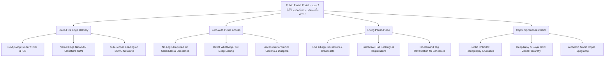

# بوابة كنيسة القديسين مكسيموس ودوماديوس والشهيد الأنبا موسى الأسود
# Church of Saints Maximus & Domadius and St. Moses the Black — Official Parish Web Portal

---

## 1. الفهرس العام للوثائق والمواصفات الفنية (Documentation Suite Index)

تضم هذه الحزمة التوثيقية الهندسية المتكاملة (**الإصدار 1.1.0**) 9 وثائق رئيسية تغطي كافة أبعاد النظام البرمجي للبوابة الرقمية لكنيسة القديسين مكسيموس ودوماديوس والشهيد العظيم الأنبا موسى الأسود (العصافرة - الإسكندرية / كنيسة الأقباط الأرثوذكس)، إضافة إلى طبقة عمليات الوكلاء (`AGENTS.md` / `CLAUDE.md` / `docs/agents/` / `docs/adr/` / `memory-bank/`).

| الرقم | الوثيقة (Document) | المسار (File Path) | الغرض والنطاق الفني (Scope & Purpose) |
| :--- | :--- | :--- | :--- |
| **01** | **الدليل العام والمدخل الاستراتيجي** | [`README.md`](./README.md) | الرؤية الاستراتيجية، سياق التحول المعماري، فلسفة التصميم، والواجهة الشاملة للتنفيذ. |
| **02** | **وثيقة متطلبات المنتج الكاملة** | [`PRODUCT_REQUIREMENTS_DOCUMENT.md`](./PRODUCT_REQUIREMENTS_DOCUMENT.md) | تفصيل وظيفي دقيق وشامل لأكثر من 35 صفحة وخدمة كنسية، سيناريوهات الاستخدام، ومحددات الجودة. |
| **03** | **هندسة المعلومات وتصميم المسارات** | [`INFORMATION_ARCHITECTURE.md`](./INFORMATION_ARCHITECTURE.md) | خريطة الموقع الكاملة، هيكلية المكونات الموحدة، مصفوفة التوجيه (Routing Matrix)، والتصنيف المحتوي. |
| **04** | **مواصفات قواعد البيانات والخلفية البرمجية** | [`BACKEND_AND_DATA_SPEC.md`](./BACKEND_AND_DATA_SPEC.md) | مخطط DDL SQL كامل، علاقات الجداول، سياسات الأمان RLS، مسارات API، مخططات التحقق Zod، ومواصفات لوحة التحكم. |
| **05** | **الموجه العام للذكاء الاصطناعي وإرشادات التطوير** | [`AI_DEVELOPER_PROMPT_AND_GUIDELINES.md`](./AI_DEVELOPER_PROMPT_AND_GUIDELINES.md) | برومبت جاهز للحقن المباشر في نماذج الذكاء الاصطناعي، توكنات الهوية البصرية والقبطية، شجرة الملفات، وبيانات البذر الأولية (Seed Data). |
| **06** | **سياق النطاق واللغة الموحدة** | [`CONTEXT.md`](./CONTEXT.md) | اللغة القانونية الموحدة ومصطلحات النطاق الكنسية المعتمدة وحظر الانجراف اللفظي. |
| **07** | **قرار معماري ADR-0001** | [`docs/adr/0001-static-first-headless-edge-architecture.md`](./docs/adr/0001-static-first-headless-edge-architecture.md) | قرار فصل البوابة العامة عن ERP الداخلي وثابت INV-01. |
| **08** | **سجل التغييرات v1.1** | [`CHANGELOG_v1.1.md`](./CHANGELOG_v1.1.md) | قرارات المصالحة النهائية لكل تعارض بين الوثائق قبل البناء. |

---

## 2. السياق الاستراتيجي والتحول المعماري (Executive Context & Architectural Shift)

### 2.1 مأزق الأنظمة الإدارية المغلقة (The Bloated Internal ERP Dilemma)
سعت العديد من الكنائس في السنوات الأخيرة إلى رقمنة خدماتها عبر بناء أنظمة تخطيط موارد مؤسسية (ERP) ضخمة ومغلقة تشمل قواعد بيانات سرية للاعترافات، وسجلات افتقاد معقدة، وأنظمة مالية محكمة خلف شاشات تسجيل دخول إلزامية. ورغم نبل المسعى، أثبتت التجربة الميدانية ظهور معضلات تشغيلية حرجة:
1. **عزلة شعب الكنيسة عن المعلومات الحيوية**: مواعيد القداسات، جدول العيادات الطبية، وبرامج مدارس الأحد كانت تضيع خلف جدران تسجيل الدخول أو داخل مجموعات واتساب وفيسبوك غير منظمة وسريعة التشتت.
2. **ثقل وتكلفة الصيانة**: أنظمة ERP المتشعبة تتطلب خوادم مخصصة باهظة التكلفة، وتحديثات معقدة، وتعاني من بطء شديد عند تصفحها عبر الهواتف المحمولة في المناطق ذات الاتصال الضعيف.
3. **مخاطر الخصوصية والأمان الرقمي**: تخزين بيانات حساسة للأسر والأفراد في منصات سحابية غير محصنة ضد الاختراق خلق مخاطر قانونية وأخلاقية جسيمة.

### 2.2 النموذج المرجعي وحتمية البوابة المجتمعية المفتوحة (The Reference Model)
انطلاقاً من دراسة متأنية للتجربة الرائدة لموقع **كنيسة القديس أثناسيوس الرسولي بالسيوف** (`https://stathanasius-elseyouf.com/`)، استقر القرار الرعوي والتقني لكنيسة القديسين مكسيموس ودوماديوس والأنبا موسى الأسود على الفصل الصارم بين:
- **الطبقة الإدارية المغلقة (Private Parish Ledger)**: تظل معزولة تماماً داخل شبكة الكنيسة الداخلية لأعمال الافتقاد والخدمات الاجتماعية السرية.
- **البوابة الرقمية الرعوية المفتوحة (Public Parish Portal)**: واجهة عامة، خفيفة، فائقة السرعة، لا تتطلب تسجيل دخول للمواطنين العاديين، وتقدم إشعاعاً روحياً وخدمياً شفافاً لكل فرد في الحي السكني والمهجر.

---

## 3. الركائز المعمارية الأساسية (Key Architectural Pillars)



### الركيزة الأولى: التوليد المسبق والتسليم الفائق عبر الحافة (Static-First Edge Architecture)
تعتمد البوابة نمط **Incremental Static Regeneration (ISR)** عبر Next.js. يتم توليد صفحات الخدمات، المقالات، وأدلة الآباء الكهنة والمذابح كملفات HTML مسبقة التوليد ومخزنة على شبكات الحافة (Edge CDN). هذا يضمن زمن تحميل لحظي (أقل من 800 مللي ثانية) واستهلاكاً شبه معدوم لموارد الخادم حتى في أوقات الذروة (مثل ليلة عيد القيامة وليلة عيد الميلاد).

### الركيزة الثانية: سهولة الوصول المطلقة وإسقاط حواجز الدخول (Zero-Auth Public Access)
يحق لأي زائر، سواء كان شيخاً مسناً يبحث عن موعد قداس الفجر، أو أماً تبحث عن طبيب أطفال في مستوصف الكنيسة، أو مغترباً في المهجر يود متابعة البث المباشر، أن يصل إلى المعلومة بنقرة واحدة دون الحاجة إلى إنشاء حساب أو تذكر كلمة مرور.

### الركيزة الثالثة: التحديث اللحظي لنبض الكنيسة (The Living Parish Pulse)
الفصل بين البناء الساكن والمحتوى الديناميكي من خلال طبقة Supabase خفيفة:
- تُحدَّث بيانات العيادات (التخصصات، أرقام الغرف، الرسم الرمزي للكشف) وهاتف الاستقبال من مصدر بيانات واحد دون نشر أسماء أطباء أو جداول حضور أو أشرطة اعتذار.
- تنعكس التعديلات الطارئة على مواعيد القداسات والأعياد على الفور عبر Server Actions وإعادة التحقق حسب الطلب (On-Demand Tag Revalidation).

### الركيزة الرابعة: الأصالة البصرية القبطية والتصميم الإنساني (Coptic Aesthetic & Empathy)
تصميم وقور يستلهم الروح القبطية الأرثوذكسية العريقة؛ مزيج متوازن بين الأزرق الملوكي البحري الداكن (`#1E2A78`) رمز السماء والعمق اللاهوتي، والذهب البيزنطي القبطي (`#C5A880`) رمز المجد الأبدي والنور الإلهي، مع أرضية رخامية كريمية مريحة للعين (`#FAF8F5`) وخطوط عربية عريضة واضحة لكبار السن.

---

## 4. المكدس التقني المعتمد (Approved Tech Stack)

| الطبقة التقنية (Layer) | التقنية المختارة (Technology) | المبرر الفني والتشغيلي (Technical Justification) |
| :--- | :--- | :--- |
| **بيئة التشغيل والإطار العام** | **Next.js 15 (App Router)** | دعم أصيل للـ React Server Components (RSC)، التوليد الثابت المتزايد (ISR)، وسهولة التوسيع مستقبلاً. |
| **لغة البرمجة الأساسية** | **TypeScript 5.x (Strict Mode)** | صرامة برمجية كاملة ومنع الأخطاء أثناء وقت التجميع مع تكامل تام مع أنواع قواعد البيانات. |
| **محرك التصميم والواجهات** | **Tailwind CSS + Shadcn/ui** | نظام أدوات تصميم مرن، خفيف الحجم، يدعم نمط الاتجاه من اليمين لليسار (RTL First) بشكل أصيل. |
| **قاعدة البيانات ونظام الإدارة** | **Supabase (PostgreSQL 15+) + @supabase/ssr** | قاعدة بيانات علائقية متينة، دعم أصيل لسياسات الأمان RLS، حزمة SSR الرسمية لإدارة الجلسات، وتوفير لوحة إدارة سلسة لخدام الكنيسة. |
| **إدارة النماذج والتحقق** | **React Hook Form + Zod** | معالجة منضبطة وخفيفة لبيانات نماذج الحجز والمراسلات مع تحقق صارم في المتصفح والخادم. |
| **الأيقونات والرموز البصرية** | **Lucide React + Coptic Custom Icons** | خط أيقونات عصري ومتناسق مع رسومات متجهة مخصصة للصلبان والأيقونات القبطية. |
| **الاستضافة وشبكة التوزيع** | **Vercel / Cloudflare Edge** | شبكة توزيع محتوى عالمية مع شهادات أمان SSL مجانية ومراقبة لحظية للأداء والاستقرار. |

---

## 5. هيكلية المستودع البرمجي المقترحة (Repository File Tree)

```text
church-site/
├── .github/workflows/          # خطوط الإنتاج والتحقق التلقائي (CI/CD Pipeline)
├── public/
│   ├── fonts/                  # الخطوط العربية والقبطية المحلية (Noto Kufi, Alexandria)
│   ├── icons/                  # الصلبان والرموز القبطية المصممة بـ SVG
│   ├── images/
│   │   ├── altars/             # صور مذابح الكنيسة الثلاثة
│   │   ├── clergy/             # صور الآباء الكهنة الموقرين
│   │   ├── clinics/            # صور وأيقونات التخصصات الطبية بالمستوصف
│   │   └── hero/               # لقطات بانورامية لواجهة الكنيسة والصحن
│   └── favicon.ico
├── src/
│   ├── app/                    # توجيهات Next.js App Router (أكثر من 35 مساراً)
│   │   ├── layout.tsx          # الترويسة والتذييل العام وإعدادات RTL
│   │   ├── page.tsx            # الصفحة الرئيسية (الصفحة الشاملة لنبض الكنيسة)
│   │   ├── about/              # صفحات تاريخ الكنيسة، الرعاة، والمذابح
│   │   ├── masses/             # جداول القداسات الأسبوعية وتفاصيل المذابح
│   │   ├── clinics/            # دليل المستوصف، دليل التخصصات، وأرقام الغرف
│   │   ├── meetings/           # الاجتماعات النوعية حسب المراحل العمرية (11 اجتماعاً)
│   │   ├── education/          # المدارس والمعاهد الكنسية (الشماسة، الكتاب، الألحان)
│   │   ├── activities/         # الأنشطة الرعوية (الكشافة، النادي، المسرح، الكمبيوتر)
│   │   ├── services/           # الخدمات المجتمعية (الحضانة، المستوصف، المشغل، المقصف)
│   │   ├── live/               # البث المباشر وصلوات المناسبات
│   │   ├── condolence/         # حجز قاعة العزاء والاستعلام
│   │   └── bible/              # الكتاب المقدس القبطي الأرثوذكسي مع البحث
│   ├── components/             # مكونات الواجهة المعيارية القابلة لإعادة الاستخدام
│   │   ├── layout/             # الهيدر، الميجا منيو، القائمة المتنقلة، الفوتر
│   │   ├── ui/                 # مكونات Shadcn المعدلة بهوية قبطية
│   │   ├── cards/              # بطاقات القداس، التخصص، الاجتماع، الخدمة
│   │   └── forms/              # نماذج الحجز، الاستفسار، والتسجيل
│   ├── lib/                    # الدوال المساعدة، اتصالات قاعدة البيانات
│   │   ├── supabase/           # عملاء Supabase للمتصفح والخادم
│   │   └── utils.ts            # دوال معالجة التواريخ القبطية والمصفوفات
│   ├── types/                  # تعريفات TypeScript الشاملة لكافة الجداول والنماذج
│   ├── actions/                # Server Actions (الحجوزات، الاعتذارات، الرسائل، التسجيلات)
│   └── styles/                 # متغيرات Tailwind وأنماط CSS المخصصة
├── AGENTS.md                   # تعليمات الوكلاء (تُنسخ مطابقة إلى CLAUDE.md)
├── CLAUDE.md                   # نسخة مطابقة لـ AGENTS.md
├── CONTEXT.md                  # اللغة الموحدة للنطاق
├── README.md                   # هذه الوثيقة
├── CHANGELOG_v1.1.md           # سجل قرارات المصالحة v1.1
├── PRODUCT_REQUIREMENTS_DOCUMENT.md
├── INFORMATION_ARCHITECTURE.md
├── BACKEND_AND_DATA_SPEC.md
├── AI_DEVELOPER_PROMPT_AND_GUIDELINES.md
├── docs/
│   ├── adr/                    # قرارات معمارية (ADR-0001)
│   └── agents/                 # بروتوكولات الوكلاء (issue-tracker, triage-labels, domain)
└── memory-bank/                # بنك الذاكرة الإلزامي للوكلاء (6 ملفات)
```

---

## 6. كيفية استخدام ومتابعة وثائق المشروع (How to Navigate the Specs)

1. **للمهندسين والمطورين الجدد**: ابدأ بقراءة وثيقة [`PRODUCT_REQUIREMENTS_DOCUMENT.md`](./PRODUCT_REQUIREMENTS_DOCUMENT.md) لفهم البنية الوظيفية لكل قسم ورسالة الكنيسة في كل خدمة، ثم انتقل إلى [`BACKEND_AND_DATA_SPEC.md`](./BACKEND_AND_DATA_SPEC.md) لتنفيذ مخطط قاعدة البيانات وتطبيق سياسات الأمان RLS.
2. **لمطوري واجهات المستخدم (UI/UX Engineers)**: راجع بدقة وثيقة [`INFORMATION_ARCHITECTURE.md`](./INFORMATION_ARCHITECTURE.md) للتعرف على تشريح الصفحات والمكونات المعيارية الموحدة (Universal Anatomy) ومصفوفة المسارات.
3. **للاستعانة بنماذج الذكاء الاصطناعي (AI Prompting)**: افتح وثيقة [`AI_DEVELOPER_PROMPT_AND_GUIDELINES.md`](./AI_DEVELOPER_PROMPT_AND_GUIDELINES.md) وانسخ البرومبت الشامل ونفذه مباشرة في بيئة عملك لبناء المكونات، الصفحات، وبيانات البذر في دقائق معدودة.
4. **لوكلاء الذكاء الاصطناعي المنفذين (Agent Ops)**: اقرأ [`AGENTS.md`](./AGENTS.md) و[`CONTEXT.md`](./CONTEXT.md) وADR-0001 أولاً، وحافظ على مزامنة ملفات `memory-bank/` في بداية كل مهمة ونهايتها.

---
**بركة شفاعة القديسين مكسيموس ودوماديوس والشهيد العظيم الأنبا موسى الأسود فلتكن مع جميع العاملين في هذا العمل المبارك.**
