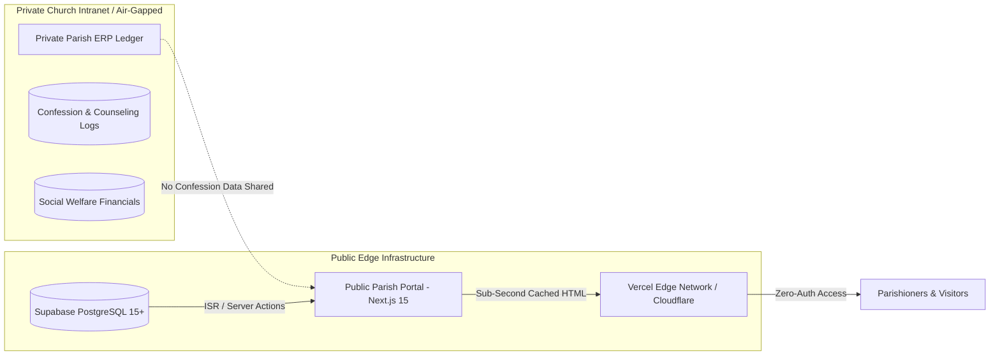

# ADR-0001: Decoupling Heavy Internal ERP from Public-Facing Parish Portal via Next.js 15 + Supabase Edge ISR

- **Status**: Accepted
- **Date**: 2026-09-14
- **Deciders**: Lead Architect, Parish Priest Council, Senior Engineering Lead
- **Invariant**: **INV-01 (Strict Separation of Public Portal and Private ERP)**

---

## 1. Context & Problem Statement

Historically, many Orthodox parishes attempted to digitize pastoral and administrative operations by commissioning monolithic, all-in-one Enterprise Resource Planning (ERP) systems. These closed systems consolidated:
1. Highly confidential pastoral confession logs and priest counseling notes.
2. Sensitive parishioner social welfare dossiers (إخوة الرب).
3. Complex internal ecclesiastical accounting and donation tracking.
4. Routine public parish information (mass timings, clinic specialty and room directories, sunday school meetings).

In practice, this monolithic ERP model created critical systemic failures:
- **Information Lockdown for Parishioners**: Essential pastoral information—such as dawn liturgy times, clinic specialty and room directories, and clinic service notices—was buried behind mandatory authentication gates or fragmented into chaotic WhatsApp and Facebook posts. Elderly parishioners and diaspora members were effectively disenfranchised.
- **Server Degradation During Peak Feasts**: Heavy server-side rendered ERP architectures consistently crashed or experienced multi-second latencies during high-traffic religious events (e.g., Christmas Eve, Good Friday, Easter midnight liturgies).
- **Severe Privacy & Liability Risks**: Exposing a cloud-hosted relational database containing confession records and intimate personal dossiers created unacceptable ethical and security risks.

The parish leadership and engineering team examined the successful community reference model of the Church of St. Athanasius the Apostolic in El-Seyouf, Alexandria (`https://stathanasius-elseyouf.com/`). The finding was clear: **parishioners require an open, sub-second, zero-friction public portal, not an administrative ERP.**

---

## 2. Decision: Architectural Decoupling & Invariant INV-01

We have decided to strictly decouple the parish digital ecosystem into two separate, non-overlapping domains:

### Invariant INV-01: Architectural Isolation
> **Invariant INV-01**:
> 1. The public parish portal shall never require authentication for public directories, liturgy schedules, clinic specialty and room directories, or clinic service notices.
> 2. The public parish database and edge runtime shall never store, process, or interface with confidential confession records, private spiritual counseling journals, or internal financial ledgers.
> 3. Any feature or issue proposing to bring private ERP ledger operations into this portal shall be triaged as `wontfix`.

---

## 3. Technical Implementation Details

1. **Framework & Runtime**: Next.js 15 App Router with React Server Components (RSC).
2. **Delivery Strategy**: Static-First with Incremental Static Regeneration (ISR).
   - High-stability pages (History, Altars, Clergy bios, Academies) use SSG with long revalidation intervals (`revalidate = 86400` or on-demand).
   - Dynamic schedule pages (Masses, Clinics, Meetings) use on-demand tag revalidation via the canonical registry `src/lib/tags.ts` (`revalidateTag("masses")`, `revalidateTag("clinic-specialties")`).
3. **Database & Edge Backend**: Supabase (PostgreSQL 15+) with Row Level Security (RLS).
   - Public read policies on all active schedules and content (`USING (is_active = TRUE)`).
   - Public insert policies limited strictly to unauthenticated condolence booking submissions (`status = 'pending'`) and contact inquiries.
   - Admin authentication restricted strictly to verified parish servants and priests (`/admin`) via a `profiles` table with role-checked RLS (`is_staff()` / `is_admin()` SECURITY DEFINER helpers) — never bare `TO authenticated` grants — for publishing schedules and content updates.
4. **Performance Target**: First Contentful Paint (FCP) < 800ms and Largest Contentful Paint (LCP) < 1.2s on standard 3G/4G Egyptian mobile networks.

---

## 4. Consequences & Trade-offs

### Positive
- **Zero-Friction Access**: Senior citizens, diaspora youth, and local residents access schedules in under 1 second without remembering credentials.
- **Extreme Peak Resilience**: Liturgy schedule pages are cached as static HTML on edge points of presence (PoPs), easily absorbing tens of thousands of concurrent visits during Christmas and Easter.
- **Absolute Privacy Assurance**: Complete absence of confession or internal financial tables eliminates catastrophic data breach surfaces.
- **Low Operational Cost**: Edge-cached static delivery minimizes Supabase compute consumption and hosting overhead.

### Negative & Mitigations
- **Two Separate Codebases**: Pastoral servants must use internal tools for confidential work and the portal admin dashboard for public updates. *Mitigation: Clean, focused Supabase `/admin` dashboard designed specifically for non-technical servants.*
- **Cache Invalidation Discipline**: Content changes must trigger explicit revalidation tags via Next.js Server Actions. *Mitigation: Centralized server actions automatically invoke `revalidateTag` upon mutation.*

---

## 5. Amendment (v1.1 — 2026-09-14)

- Revalidation tag names aligned to the canonical registry (`src/lib/tags.ts`): `masses`, `clinic-specialties`, `meetings`, `news`, `stream`, `alerts`, `condolence-bookings`.
- Admin authorization specified via `profiles.role` + `is_staff()` / `is_admin()` RLS helpers (replacing any bare `TO authenticated USING (TRUE)` grants).
- Added `mass_exceptions`, `site_alerts`, and `stream_events` tables so feast-specific schedules, alert banners, and live-stream status ride the same static-first + on-demand-revalidation pipeline (no long-lived SSR).
- Public condolence booking tracking specified as a `track_condolence_booking(ref)` SECURITY DEFINER RPC (no anon SELECT on the underlying table).
