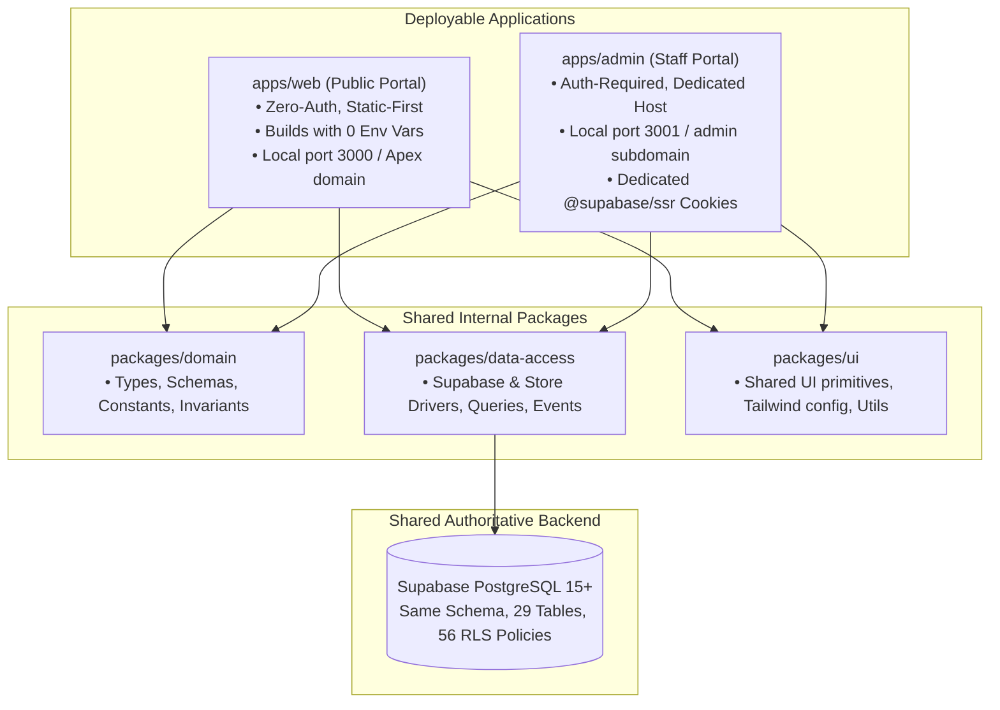

# ADR-0002: Monorepo and Admin Dashboard Separation

- **Status**: Accepted
- **Date**: 2026-09-17
- **Deciders**: Lead Architect, Parish Priest Council, Senior Engineering Lead
- **Invariants**: **INV-01 (Strict Separation of Public Portal and Private ERP)**, **Fault Isolation Invariant**

---

## 1. Context & Problem Statement

In the initial architecture, the admin dashboard was co-located inside the public Next.js application at `/admin` (`src/app/admin/**`). While convenient for early prototyping, this tight coupling introduced severe operational and architectural liabilities:
1. **Single Point of Failure for Parish Staff**: If the public portal experienced a runtime bug, deployment failure, hydration break, or upstream CDN misconfiguration, church staff and priests were completely locked out of the administrative dashboard. Staff could not update mass schedules, manage events, or review condolence bookings during critical times.
2. **Surface Area & Security Leakage Risk**: Administrative routes, server actions, and operational logic shared bundle boundaries and configuration with the public zero-auth site.
3. **Coupled Deployment Lifecycle**: Updating public content or design required redeploying administrative services, and vice versa.

To achieve high availability, strict fault isolation, and clean boundary separation, the admin dashboard must be decoupled from the public web portal while continuing to operate against the same authoritative database.

---

## 2. Decision: pnpm Monorepo Split (`apps/web` + `apps/admin` + shared packages)

We have restructured the repository into a **pnpm monorepo** with explicit application and package boundaries:

### Key Architectural Boundaries:
1. **`apps/web`**: Public parish portal. Static-first, zero-auth (INV-01), builds with zero environment variables, falls back to seed data/json-store when DB credentials are absent. Serves church schedules, clinic directories, livestreams, and community forms.
2. **`apps/admin`**: Staff administration dashboard. Runs on port 3001 locally and a dedicated subdomain (e.g., `admin.stmaximus.example`) in production. Manages masses, bookings, events, media, and subscribers.
3. **Dedicated Session Cookies**: Authentication is handled via `@supabase/ssr` with session cookies scoped to the admin host/subdomain. Public web visitors never receive administrative authentication tokens.
4. **Shared Internal Packages**:
   - `@church-site/domain`: Pure business logic, recurrence calculations, capabilities, validation schemas, and database types.
   - `@church-site/data-access`: Authoritative database and repository access layer.
   - `@church-site/ui`: UI components and design system tokens.
5. **Shared Database**: Both applications interface with the exact same Supabase database and schema. No migrations are altered.

---

## 3. Consequences

### Positive
- **Fault Isolation**: Total resilience between apps. If `apps/web` fails or is misconfigured, `apps/admin` continues running unimpeded, allowing priests and administrators to manage parish data.
- **Zero Leakage**: Admin routes, components, and server actions are completely eliminated from `apps/web`. Zero admin surface is exposed to public web scrapers or visitors.
- **Independent Deployment Pipelines**: Each application can be built, tested, and deployed independently on Vercel or Node runtimes.
- **Single Source of Truth**: Domain models, recurrence rules, and Supabase TypeScript definitions are centralized in `packages/*` avoiding drift.

### Negative / Trade-offs
- **Monorepo Tooling Overhead**: Requires pnpm workspace management and filter flags (`pnpm --filter web build`, `pnpm --filter admin build`).
- **Cookie Scope Consideration**: When configuring custom domains, cookies must be scoped properly to prevent cross-subdomain collisions.
