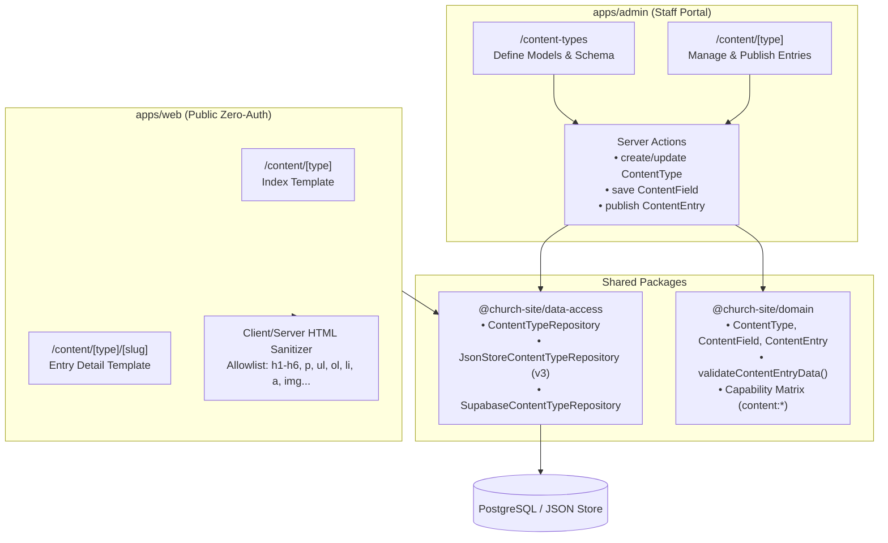

# ADR-0003: Dynamic Content Types Engine & EAV-lite Architecture

- **Status**: Accepted
- **Date**: 2026-09-17
- **Deciders**: Lead Architect, Senior Engineering Lead, Parish Content Operations
- **Invariants**: **INV-01 (Zero-Auth Public Portal Isolation)**, **Zero-Code Content Extensibility**, **Dual-Driver Parity**
- **Implementation**: Implemented in Phase 3 (Content Types Engine)

---

## 1. Context & Problem Statement

Parish life is dynamic. Beyond standard liturgical schedules and sermons, church departments continuously launch new initiatives: seasonal pilgrimage trips, specialized medical clinic schedules, youth retreat registrations, Sunday school curricula, and spiritual publications.

Prior to Phase 3, introducing any new category of content required:
1. Writing database migrations with dedicated relational tables.
2. Modifying TypeScript domain definitions in `@church-site/domain`.
3. Updating `@church-site/data-access` repositories and queries.
4. Implementing custom Admin UI pages and Server Actions.
5. Implementing custom public routes and page components in `apps/web`.
6. Full rebuild and production redeployment.

This created an operational bottleneck: parish administrators could not announce new service categories or customize form fields without developer intervention and software deployment cycles.

---

## 2. Decision: EAV-lite CMS Engine with Dynamic Runtime Validation

We implement a flexible, high-performance **Entity-Attribute-Value (EAV-lite)** content engine structured across three relational tables in PostgreSQL (and mirrored in the JSON file store schema v3):

1. **`content_types`**: Metamodel defining a distinct category of content (e.g. `trips`, `articles`, `books`), specifying naming (`name_ar`, `name_en`), default layout template (`default`, `article`, `index`), and active status.
2. **`content_fields`**: Metamodel defining individual attributes attached to a content type (e.g. `destination`, `ticket_price`, `departure_date`). Supports seven primitive field types:
   - `text`: Single-line text.
   - `rich_text`: Sanitized multi-line HTML content.
   - `number`: Numeric value (integers/floats).
   - `boolean`: Boolean flag.
   - `date`: ISO calendar date.
   - `media_ref`: Reference to an uploaded media asset.
   - `json`: Arbitrary structured JSON data.
   Each field configures validation constraints: `is_required`, `is_translatable`, `min_value`, `max_value`, `min_length`, `max_length`, `regex_pattern`, and `allowed_options`.
3. **`content_entries`**: Instances of content belonging to a content type. Carries generic metadata (`title_ar`, `title_en`, `slug`, `status`, `published_at`) and an untyped JSONB dictionary `data` containing field values keyed by `content_fields.slug`.

### Dynamic Runtime Validation
Rather than relying on static compile-time Zod schemas, entries are validated dynamically against their active field definitions at runtime using `validateContentEntryData(fields, data)`. Validation executes:
- Prior to database persistence in Admin Server Actions (`createContentEntryAction`, `updateContentEntryAction`).
- During dual-driver repository operations (`JsonStoreContentTypeRepository` and `SupabaseContentTypeRepository`).

### Generic Public Route Architecture
Public routes in `apps/web` expose dynamic content under a dedicated `/content` namespace:
- `/content/[type]`: Directory index listing published entries for the content type.
- `/content/[type]/[slug]`: Detailed view for an individual published content entry.

### Zero-Auth Invariant (INV-01) Adherence
- `apps/web` utilizes public read-only repository calls (`getContentTypeBySlug`, `listContentEntries({ status: "published" })`).
- `generateStaticParams` queries active content types and published entries when available, falling back gracefully to empty lists when building with zero environment variables.
- Draft entries (`status: "draft"`) and archived entries (`status: "archived"`) are strictly filtered out on the public site and cannot be accessed.

---

## 3. Architecture Diagram

---

## 4. Consequences & Trade-offs

### Positive Consequences
- **Zero-Code Operational Agility**: Church staff can add a new category (e.g. "Youth Retreats" or "Sunday School Lectures") and start publishing entries within 2 minutes from the admin panel.
- **Strict Invariant Isolation**: Administrative mutations never leak into `apps/web`; zero authentication or database credentials needed in the public portal.
- **Zero New Dependencies**: Implemented strictly with native React primitives, native HTML sanitization, and built-in `node:crypto`.
- **Dual-Driver Parity**: Local testing, CI pipelines, and environments without Supabase credentials function seamlessly via JSON store schema v3.

### Trade-offs & Mitigations
- **JSONB Query Indexing**: Field values in `content_entries.data` are stored in JSONB rather than distinct typed SQL columns. *Mitigation*: Migration `20260916130000_content_types.sql` attaches GIN indexes (`gin_content_entries_data`) for high-speed attribute queries.
- **Slug Collisions**: Slugs must be unique per content type. *Mitigation*: Unique composite constraint `uq_content_entries_type_slug (content_type_id, slug)` enforced at the database level.
