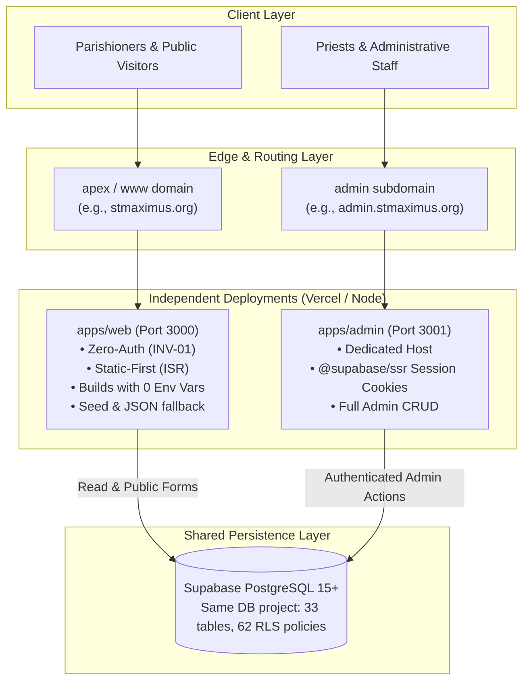

# Monorepo Deployment & Hosting Guide / دليل النشر المستقل

This document details the multi-application deployment architecture resulting from Phase 1 monorepo separation.

---

## 1. Architecture Overview

The repository is structured as a pnpm monorepo hosting two independent deployable Next.js 15 applications connected to shared packages and a shared Supabase database.



---

## 2. Applications Specification

### 2.1 `apps/web` (Public Parish Portal)

- **Target Domain**: Apex / root domain (`stmaximus.org` or `www.stmaximus.org`).
- **Local Port**: `3000` (`pnpm dev:web` or `pnpm --filter web dev`).
- **Authentication**: **Zero authentication** (INV-01). No login, no session cookies.
- **Build Invariant**: **Must build with NO environment variables**. When Supabase credentials are not supplied, the app automatically falls back to seeded static data and local JSON storage (`CHURCH_DATA_DIR`).
- **Caching**: Aggressive Static-First caching with ISR for mass schedules, clinic directories, and events.
- **Environment Variables**:
  - `NEXT_PUBLIC_SUPABASE_URL`: Optional at build time; enables live data at runtime.
  - `NEXT_PUBLIC_SUPABASE_ANON_KEY`: Optional at build time; enables live data at runtime.
  - `SUPABASE_SERVICE_ROLE_KEY`: Optional; required for public forms write path.
  - `NEXT_PUBLIC_TURNSTILE_SITE_KEY` / `TURNSTILE_SECRET_KEY`: Optional in dev; recommended in production.
  - `NEXT_PUBLIC_SITE_URL`: Canonical site URL (default `http://localhost:3000`).
  - `NEXT_PUBLIC_YOUTUBE_CHANNEL_URL`: Optional link for `/live`.
  - `CHURCH_DATA_DIR`: File-backed storage location when Supabase is unconfigured (default `.data`).
  - `MAIL_PROVIDER`: Operational email provider (`resend` or `noop`, default `noop`).
  - `RESEND_API_KEY`: Server-only Resend API key (`re_...`, required if `MAIL_PROVIDER=resend`).
  - `RESEND_FROM_EMAIL`: Server-only sender email address (e.g. `notifications@stmaximus.church`).

### 2.2 `apps/admin` (Administrative Dashboard)

- **Target Domain**: Dedicated subdomain (`admin.stmaximus.org`).
- **Local Port**: `3001` (`pnpm dev:admin` or `pnpm --filter admin dev`).
- **Authentication**: Required. Managed via `@supabase/ssr` with server-side cookie management (`sb-*-auth-token`) scoped to the admin subdomain.
- **Build Behavior**: Builds static login shell and dynamic management routes (`/audit`, `/bookings`, `/content-types`, `/content`, `/events`, `/masses`, `/media`, `/subscribers`, `/videos`).
- **Fault Isolation**: Completely isolated from `apps/web`. If `apps/web` suffers an outage or breaking build, `apps/admin` remains fully operational.
- **Environment Variables**:
  - `NEXT_PUBLIC_SUPABASE_URL`: Required for admin operations.
  - `NEXT_PUBLIC_SUPABASE_ANON_KEY`: Required for admin authentication.
  - `SUPABASE_SERVICE_ROLE_KEY`: Required for privileged actions and media uploads to bucket `media`.
  - `MAIL_PROVIDER`: Operational email provider (`resend` or `noop`, default `noop`).
  - `RESEND_API_KEY`: Server-only Resend API key (`re_...`, required when `MAIL_PROVIDER=resend`).
  - `RESEND_FROM_EMAIL`: Verified parish sender address (e.g. `notifications@stmaximus.church`).
  - `NEXT_PUBLIC_TURNSTILE_SITE_KEY` / `TURNSTILE_SECRET_KEY`: Optional.
- **Supabase Storage Requirements**:
  - Production Supabase instance requires bucket `media` created via migration `20260916120000_media_storage.sql`.
  - `SUPABASE_SERVICE_ROLE_KEY` is required on `apps/admin` for administrative uploads to bucket `media`.
  - `apps/web` needs no storage credentials or bucket access (renders via public HTTP GET URLs).

### 2.3 Database Migrations & Supabase CLI (`supabase db push`)

Both applications connect to the authoritative Supabase project. Database migrations (1–14) are located in `supabase/migrations/` and applied sequentially via the Supabase CLI:

```bash
# 1. Authenticate with Supabase CLI
supabase login

# 2. Link local repository to target Supabase project
supabase link --project-ref <project-ref>

# 3. Push all 14 migrations in order
supabase db push
```

**Applied Migration Sequence (1–14)**:
1. `20260916090000_extensions_and_enums.sql`: Base extensions & 9 core ENUMs.
2. `20260916090100_profiles_and_helpers.sql`: Profiles table, user triggers, security definer helpers.
3. `20260916090200_public_content_tables.sql`: 12 public content and directory tables.
4. `20260916090300_v11_tables.sql`: 8 v1.1 tables (Bible reader, donations, education).
5. `20260916090400_rpc_functions.sql`: RPCs (`track_condolence_booking`, `search_bible`).
6. `20260916090500_indexes.sql`: Relational indexes and constraints.
7. `20260916090600_row_level_security.sql`: RLS policies on core 21 tables.
8. `20260916090700_events_taxonomy_media_audit.sql`: Events system, taxonomies, media records, audit log.
9. `20260916090800_events_rls_policies.sql`: Events and audit log RLS policies.
10. `20260916090900_subscribers.sql`: Notification subscribers table and audit enum additions.
11. `20260916091000_subscribers_rls_policies.sql`: Strict non-public RLS on subscribers.
12. `20260916120000_media_storage.sql`: Storage bucket `media` and `storage.objects` RLS policies.
13. `20260916130000_content_types.sql`: Content types engine (`content_types`, `content_fields`, `content_entries`).
14. `20260916140000_parish_videos.sql`: Parish videos table (`parish_videos`) with provider enum and RLS.

---

## 3. Hosting & Deployment Configurations

### Option A: Vercel Deployments (Recommended)

When deploying to Vercel, configure two separate Vercel projects linked to the same GitHub repository:

#### Vercel Project 1: `church-site-web`
- **Root Directory**: `apps/web`
- **Build Command**: `pnpm --filter web build` (or Next.js default `next build`)
- **Output Directory**: `.next`
- **Install Command**: `pnpm install`
- **Domain**: `stmaximus.org`, `www.stmaximus.org`
- **Environment Variables**: Production Supabase + Turnstile keys, plus optional Resend keys (`MAIL_PROVIDER`, `RESEND_API_KEY`, `RESEND_FROM_EMAIL`). (Verify build succeeds even if keys are omitted).

#### Vercel Project 2: `church-site-admin`
- **Root Directory**: `apps/admin`
- **Build Command**: `pnpm --filter admin build` (or Next.js default `next build`)
- **Output Directory**: `.next`
- **Install Command**: `pnpm install`
- **Domain**: `admin.stmaximus.org`
- **Environment Variables**: Same Supabase project keys as `church-site-web`, plus `SUPABASE_SERVICE_ROLE_KEY` required for administrative media uploads to bucket `media`, and Resend keys (`MAIL_PROVIDER`, `RESEND_API_KEY`, `RESEND_FROM_EMAIL`).

> [!NOTE]
> **Supabase Storage Provisioning**:
> Production Supabase instances require bucket `media` created via migration `20260916120000_media_storage.sql` (configured with `public: true` and RLS policies on `storage.objects`). `SUPABASE_SERVICE_ROLE_KEY` is required on `church-site-admin` for staff media uploads. `church-site-web` needs no storage credentials or bucket configuration.

---

### Option B: Node / Docker Container Hosting

For containerized or self-hosted deployments:

1. **Build Step**:
   ```bash
   pnpm install --frozen-lockfile
   pnpm typecheck
   pnpm test
   pnpm --filter web build
   pnpm --filter admin build
   ```

2. **Process Management (e.g. systemd or PM2)**:
   - Run `apps/web`:
     ```bash
     PORT=3000 pnpm --filter web start
     ```
   - Run `apps/admin`:
     ```bash
     PORT=3001 pnpm --filter admin start
     ```

3. **Reverse Proxy (Nginx / Cloudflare)**:
   - Route `stmaximus.org` → reverse proxy to `http://localhost:3000`
   - Route `admin.stmaximus.org` → reverse proxy to `http://localhost:3001`
   - Ensure `Host`, `X-Forwarded-For`, and `X-Forwarded-Proto` headers are passed.
