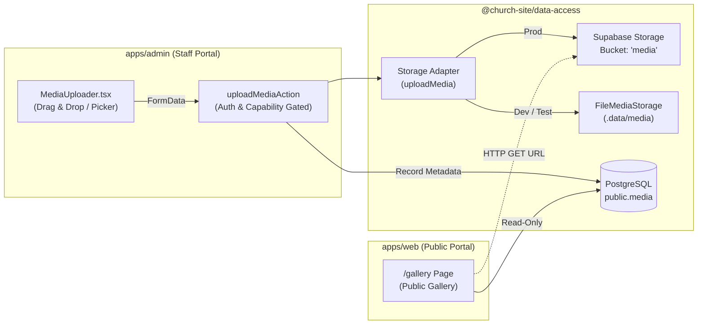

# Media Storage & Upload Architecture — Coptic Orthodox Parish Portal

## 1. Purpose & Architectural Overview

The parish portal provides an integrated media upload and storage pipeline designed to handle liturgical photography, event announcements, audio/video recordings, and parish documentation (PDFs) without compromising the zero-authentication public access guarantees ([INV-01]).

Prior to Phase 2, the media library registered metadata only (external URLs). Phase 2 introduces real binary asset storage, dual storage adapters, file hashing, and administrative upload controls while keeping the public-facing application (`apps/web`) entirely decoupled from administrative credentials, storage buckets, and mutating storage APIs.



---

## 2. Supabase Storage Bucket Configuration

- **Bucket Identifier**: `media`
- **Visibility**: Public (`public: true`)
- **Schema**: `storage.buckets`
- **Migration**: `supabase/migrations/20260916120000_media_storage.sql`

```sql
INSERT INTO storage.buckets (id, name, public)
VALUES ('media', 'media', true)
ON CONFLICT (id) DO NOTHING;
```

Because the bucket is marked `public: true`, objects stored within it are directly addressable via public HTTP GET URLs without needing signed URLs or visitor authentication tokens:
`${NEXT_PUBLIC_SUPABASE_URL}/storage/v1/object/public/media/${storagePath}`

---

## 3. Storage Key Scheme & Data Integrity

### 3.1 Path Partitioning Format
Storage keys are structured to ensure high performance, prevent hot-spotting, and guarantee collision resistance:

$$\text{Key Format: } \texttt{YYYY/MM/<uuid>.<ext>}$$

- `YYYY`: 4-digit UTC calendar year (e.g., `2026`).
- `MM`: 2-digit zero-padded UTC month (e.g., `09`).
- `<uuid>`: Version 4 RFC-4122 collision-resistant UUID generated by `node:crypto.randomUUID()`.
- `<ext>`: Sanitized file extension derived from the filename or mapped safely from verified MIME types (`jpg`, `png`, `webp`, `gif`, `svg`, `mp4`, `pdf`).

### 3.2 Checksum & Deduplication
Every uploaded object has its SHA-256 digest computed synchronously before transmission:
- Digest format: 64-character lowercase hexadecimal string (`crypto.createHash("sha256").update(bytes).digest("hex")`).
- Persisted in `public.media.checksum VARCHAR(64)` for auditing, deduplication, and data integrity verification.

---

## 4. Row-Level Security (RLS) on `storage.objects`

Access control to storage objects is enforced natively within PostgreSQL on `storage.objects` via migration `20260916120000_media_storage.sql`:

### 4.1 Public Read
All visitors (unauthenticated public) may read objects from the `media` bucket:
```sql
CREATE POLICY "Public read media storage objects"
ON storage.objects FOR SELECT
TO public
USING (bucket_id = 'media');
```

### 4.2 Staff Write / Update / Delete
Only authenticated users with roles `admin` or `secretary` in `public.profiles` are permitted to insert, modify, or delete objects in the `media` bucket:
```sql
-- INSERT Policy
CREATE POLICY "Staff insert media storage objects"
ON storage.objects FOR INSERT
TO authenticated
WITH CHECK (
    bucket_id = 'media'
    AND EXISTS (
        SELECT 1 FROM public.profiles
        WHERE id = auth.uid()
          AND role IN ('admin', 'secretary')
    )
);

-- UPDATE Policy
CREATE POLICY "Staff update media storage objects"
ON storage.objects FOR UPDATE
TO authenticated
USING (
    bucket_id = 'media'
    AND EXISTS (
        SELECT 1 FROM public.profiles
        WHERE id = auth.uid()
          AND role IN ('admin', 'secretary')
    )
)
WITH CHECK (
    bucket_id = 'media'
    AND EXISTS (
        SELECT 1 FROM public.profiles
        WHERE id = auth.uid()
          AND role IN ('admin', 'secretary')
    )
);

-- DELETE Policy
CREATE POLICY "Staff delete media storage objects"
ON storage.objects FOR DELETE
TO authenticated
USING (
    bucket_id = 'media'
    AND EXISTS (
        SELECT 1 FROM public.profiles
        WHERE id = auth.uid()
          AND role IN ('admin', 'secretary')
    )
);
```

---

## 5. Storage Adapter Pattern in `@church-site/data-access`

The data access layer abstracts binary storage operations behind an adapter interface defined in `packages/data-access/src/storage/index.ts`:

### 5.1 `MediaStorage` Interface
```typescript
export interface UploadMediaInput {
  filename: string;
  mimeType: string;
  bytes: Uint8Array | Buffer;
  isPublic?: boolean;
}

export interface UploadMediaResult {
  storagePath: string;
  publicUrl: string;
  checksum: string;
  sizeBytes: number;
}

export interface MediaStorage {
  upload(input: UploadMediaInput): Promise<UploadMediaResult>;
  delete(storagePath: string): Promise<void>;
  getPublicUrl(storagePath: string): string;
}
```

### 5.2 Implementations
1. **`SupabaseMediaStorage`**:
   - Production adapter communicating with Supabase Storage via `createAdminClient()`.
   - Uses `SUPABASE_SERVICE_ROLE_KEY` to execute uploads securely inside server actions.
   - Generates production public URLs: `${SUPABASE_URL}/storage/v1/object/public/media/${storagePath}`.

2. **`FileMediaStorage`**:
   - Hermetic fallback for zero-env builds, local development, and CI unit tests.
   - Persists binary files directly to local disk under `${CHURCH_DATA_DIR}/media` (defaulting to `.data/media`).
   - Simulates URL mapping with `/media-mock/${storagePath}`.
   - Automatically cleans up files on deletion and safely ignores `ENOENT`.

3. **Factory & Helpers**:
   - `getMediaStorage()`: Dynamically instantiates `SupabaseMediaStorage` if Supabase admin credentials exist; otherwise falls back to `FileMediaStorage`.
   - Top-level convenience exports: `uploadMedia(input)`, `deleteMediaObject(storagePath)`, and `getMediaPublicUrl(storagePath)`.

---

## 6. End-to-End Data Flow

```text
[Staff User in Browser]
       │
       ▼ 1. File Selection / Drag & Drop
[MediaUploader.tsx]
       │ Client-side pre-validation (Type & Size <= 50MB)
       │ Previews thumbnail & metadata
       ▼ 2. Form submission via FormData
[uploadMediaAction] (apps/admin/src/actions/media-upload-actions.ts)
       │ a. requireStaff() session check
       │ b. can(role, "media:create") capability validation
       │ c. Zod validation & MIME/Size enforcement
       ▼ 3. Adapter invocation
[uploadMedia()] (packages/data-access/src/storage/index.ts)
       │ a. Generates YYYY/MM/<uuid>.<ext>
       │ b. Computes SHA-256 checksum
       │ c. Writes bytes to Supabase Storage / File Storage
       ▼ 4. Database persistence
[mutateStoreDocument / public.media]
       │ Persists MediaRecord (storagePath, checksum, publicUrl, altText, metadata)
       │ Writes audit trail entry in audit_log
       │ Calls revalidateTag(REVALIDATION_TAGS.media)
       ▼ 5. Public Consumption
[/gallery Page] (apps/web/src/app/gallery/page.tsx)
       │ Queries getPublicGalleryMedia()
       │ Renders responsive <Image unoptimized src={publicUrl} />
```

---

## 7. Invariant INV-01 Preservation (Zero-Auth & Security Isolation)

The media storage architecture strictly maintains the project's foundational invariant:

1. **Zero Storage Code in `apps/web`**:
   - `apps/web` contains **0 imports** of storage clients, `@supabase/storage-js`, or mutating storage actions.
   - `apps/web` requires **0 credentials or secrets** to render uploaded media.

2. **Clean Web Delivery via Standard HTTP URLs**:
   - Media items are rendered as standard HTTP/HTTPS image URLs or HTML5 video sources.
   - Next.js `<Image unoptimized />` is utilized to avoid mandatory server-side image optimization credentials or external proxy overhead.

3. **Content Security Policy (CSP)**:
   - `next.config.ts` in `apps/web` permits media assets via CSP directive `img-src 'self' data: blob: https://*.supabase.co` and `media-src 'self' blob: https://*.supabase.co`, ensuring browsers safely render uploaded images and videos from the designated parish storage infrastructure.
