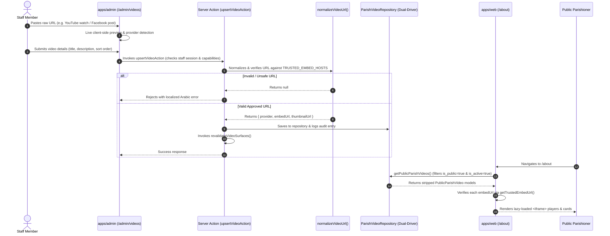

# Phase 4 Technical Architecture: Parish Videos (External URL Embeds)

## 1. Architectural Summary

Phase 4 introduces a secure, lightweight **Parish Videos Manager** allowing church staff to register existing external video URLs (YouTube, Facebook, or direct media streams) and render them on the public portal (the `/about` page under "فيديوهات الكنيسة").

This feature directly replaces the cancelled "Video Studio" roadmap item (which proposed generating MP4s via external paid render APIs). The parish leadership clarified that video generation was unnecessary because the church already broadcasts its services on YouTube and social media.

### Key Architectural Invariants Upheld
- **INV-01 (Zero-Auth Public Isolation)**: `apps/web` requires zero authentication, performs zero direct Supabase queries, builds cleanly without any environment variables, and pre-renders static pages safely.
- **Security Gate Integrity (`getTrustedEmbedUrl()`)**: Every public video embed MUST pass through the security gate before an `<iframe>` is rendered. Raw, unsanitized strings are never passed to iframe sources.
- **Strict Image Allowlist**: `images.remotePatterns` in `apps/web/next.config.ts` contains zero external wildcards.
- **Zero Third-Party Cost**: No video rendering services, no ffmpeg binaries, no paid APIs.

---

## 2. End-to-End System Flow



---

## 3. Database Schema & Migration 14

Migration file: `supabase/migrations/20260916140000_parish_videos.sql`.

### Enum: `video_provider_enum`
```sql
CREATE TYPE video_provider_enum AS ENUM ('youtube', 'facebook', 'direct');
```

### Table: `public.parish_videos`
| Column | Type | Nullable | Default | Description |
| :--- | :--- | :--- | :--- | :--- |
| `id` | `UUID` | No | `gen_random_uuid()` | Primary Key |
| `title_ar` | `TEXT` | No | - | Arabic video title |
| `title_en` | `TEXT` | Yes | `NULL` | English video title (optional) |
| `description_ar` | `TEXT` | Yes | `NULL` | Arabic description |
| `description_en` | `TEXT` | Yes | `NULL` | English description |
| `provider` | `video_provider_enum` | No | - | Source platform (`youtube`, `facebook`, `direct`) |
| `source_url` | `TEXT` | No | - | Raw URL provided by staff |
| `embed_url` | `TEXT` | No | - | Normalized embed URL from security gate |
| `thumbnail_url` | `TEXT` | Yes | `NULL` | Optional thumbnail image URL |
| `sort_order` | `INT` | No | `0` | Display ordering priority |
| `is_public` | `BOOLEAN` | No | `TRUE` | Public website visibility flag |
| `is_active` | `BOOLEAN` | No | `TRUE` | Administrative active toggle |
| `created_by` | `UUID` | Yes | `NULL` | Foreign key to `profiles(id)` |
| `updated_by` | `UUID` | Yes | `NULL` | Foreign key to `profiles(id)` |
| `created_at` | `TIMESTAMPTZ` | No | `now()` | Record creation timestamp |
| `updated_at` | `TIMESTAMPTZ` | No | `now()` | Record update timestamp |

### Indexes & Performance
```sql
CREATE INDEX IF NOT EXISTS idx_parish_videos_public_active 
    ON public.parish_videos (is_public, is_active, sort_order);
```

### Row Level Security (RLS)
1. **Public Read**: Anonymous and authenticated users can select rows where `is_public = true AND is_active = true`.
2. **Staff Read**: Authenticated staff (`admin`, `secretary`) can view all records regardless of status.
3. **Staff Mutations**: Insert, update, and delete actions are restricted to active staff profiles with `admin` or `secretary` roles.

---

## 4. URL Normalization & Security Filter

Implemented in `packages/data-access/src/videos/normalize-video-url.ts`.

### Accepted Patterns & Transformations
1. **YouTube**:
   - `https://www.youtube.com/watch?v=<id>` -> `https://www.youtube-nocookie.com/embed/<id>`
   - `https://youtu.be/<id>` -> `https://www.youtube-nocookie.com/embed/<id>`
   - `https://www.youtube.com/shorts/<id>` -> `https://www.youtube-nocookie.com/embed/<id>`
   - `https://m.youtube.com/watch?v=<id>` -> `https://www.youtube-nocookie.com/embed/<id>`
   - `https://www.youtube.com/embed/<id>` -> `https://www.youtube-nocookie.com/embed/<id>`
   - Generates trusted thumbnail URL: `https://img.youtube.com/vi/<id>/hqdefault.jpg`.
2. **Facebook**:
   - `https://www.facebook.com/.../videos/...`
   - `https://web.facebook.com/watch/?v=...`
   - `https://fb.watch/...`
   - Normalizes to: `https://www.facebook.com/plugins/video.php?href=<encoded_url>&show_text=0`.
3. **Direct Streams**:
   - `https://<project>.supabase.co/storage/v1/object/public/...` (`.mp4`, `.webm`, `.m3u8`).

### Rejections
- Any URL not using `https:` protocol.
- Javascript injection (`javascript:...`).
- Data URI injection (`data:...`).
- Phishing/lookalike domains (`fakeyoutube.com`, `youtube.com.attacker.com`).
- Direct media streams on unapproved third-party hosts.

---

## 5. Role-Based Access Control (RBAC)

Configured in `packages/domain/src/capabilities.ts`:

| Capability | Arabic Label | Viewer (`servant`) | Editor (`secretary`) | Owner (`admin`) |
| :--- | :--- | :---: | :---: | :---: |
| `videos:read` | عرض قائمة الفيديوهات | Yes | Yes | Yes |
| `videos:write` | إضافة وتعديل الفيديوهات | No | Yes | Yes |
| `videos:delete` | حذف الفيديوهات نهائياً | No | No | Yes |

---

## 6. Public Projection & Cache Revalidation

1. **Public Projection (`PublicParishVideo`)**:
   Strips internal tracking fields (`createdBy`, `updatedBy`, `createdAt`, `updatedAt`, `sourceUrl`). Only safe presentation attributes (`id`, `titleAr`, `titleEn`, `descriptionAr`, `descriptionEn`, `provider`, `embedUrl`, `thumbnailUrl`, `sortOrder`) are passed to the frontend.
2. **Cache Invalidation**:
   Mutations trigger `revalidateVideoSurfaces()`, invalidating `REVALIDATION_TAGS.parishVideos` and revalidating `/about` and `/`.
