# Phase 6 Playwright E2E Guide & Test Suite
### كنيسة القديسين مكسيموس ودوماديوس والشهيد الأنبا موسى الأسود — العصافرة، الإسكندرية

Comprehensive technical guide and runbook for the end-to-end (E2E) browser verification test suite introduced in Phase 6.

---

## 1. Overview & Architecture

The Parish Portal E2E test suite exercises real browser rendering, layout direction (RTL), dynamic route resolution, media embed security, and empty state ergonomics directly in Chromium.

```mermaid
flowchart LR
    subgraph TestRunner ["Playwright Test Suite (@playwright/test 1.63.0)"]
        TC1["Journey 1: Dynamic Content Listing (/content/article)"]
        TC2["Journey 2: Dynamic Content Detail (/content/article/...)"]
        TC3["Journey 3: Dynamic Content Empty State (/content/sermon)"]
        TC4["Journey 4: Parish Videos Embed (/about)"]
    end

    subgraph Browser ["Headless Chromium Engine"]
        DOM["DOM Tree & CSS RTL Layout (dir='rtl')"]
        CSP["CSP Validation (youtube-nocookie.com iframe)"]
        Screenshots["Artifact Screenshots (.scratch/phase6-gates/g6-screenshots/)"]
    end

    subgraph AppWeb ["apps/web (Port 3000)"]
        WebServer["Next.js 15 Standalone Server"]
        JSONStore["apps/web/.data/church-store.json (Fixture Store v4)"]
    end

    TestRunner --> Browser
    Browser --> AppWeb
    AppWeb --> JSONStore
```



### Key Principles
1. **Zero Runtime Impact**: Pinned `@playwright/test: 1.63.0` as a development-only dependency in the monorepo root. Production bundles in `apps/web` and `apps/admin` remain lean with zero extra dependencies.
2. **Zero-Auth Verification (INV-01)**: All public journeys test zero-auth access without bypass headers, mock sessions, or artificial test cookies.
3. **Deterministic Local Fixtures**: Backed by `apps/web/.data/church-store.json` containing schema v4 models for dynamic content entries and parish videos.

---

## 2. Pinned Dependencies & Configuration

### Dependency Specifications
- **Package**: `@playwright/test`
- **Version**: `1.63.0` (pinned in root `package.json` under `devDependencies`)
- **Engine**: Desktop Chromium (`devices['Desktop Chrome']`)

### Playwright Configuration (`apps/web/playwright.config.ts`)
```typescript
import { defineConfig, devices } from '@playwright/test';

export default defineConfig({
  testDir: './e2e',
  fullyParallel: false,
  workers: 1,
  use: {
    baseURL: 'http://localhost:3000',
    trace: 'on-first-retry',
  },
  projects: [
    {
      name: 'chromium',
      use: { ...devices['Desktop Chrome'] },
    },
  ],
  webServer: {
    command: 'pnpm --filter web start',
    port: 3000,
    reuseExistingServer: !process.env.CI,
  },
});
```

---

## 3. Journeys Covered in the Test Suite

The suite resides in `apps/web/e2e/` across two test specifications:

### 3.1 Dynamic Content Journeys (`apps/web/e2e/content.spec.ts`)

#### Journey 1: Dynamic Content Listing (`/content/article`)
- **Target URL**: `/content/article`
- **Verifications**:
  - Validates document direction is explicitly RTL (`<html dir="rtl">`).
  - Confirms category heading renders localized Arabic title (`مقالات وأخبار`).
  - Confirms published entry card is visible (`كنوز الآباء الأرثوذكسية`).
  - Captures full-page screenshot: `.scratch/phase6-gates/g6-screenshots/e2e-content-list.png`.

#### Journey 2: Dynamic Content Detail (`/content/article/orthodox-patristic-treasures`)
- **Target URL**: `/content/article/orthodox-patristic-treasures`
- **Verifications**:
  - Validates document direction is RTL.
  - Confirms entry title in `<article>` heading (`كنوز الآباء الأرثوذكسية`).
  - Confirms sanitized rich text body renders (`نصوص ورسائل روحية أصيلة من التراث الآبائي العريق لكنيستنا المجيدة.`).
  - Captures full-page screenshot: `.scratch/phase6-gates/g6-screenshots/e2e-content-detail.png`.

#### Journey 3: Dynamic Content Honest Empty State (`/content/sermon`)
- **Target URL**: `/content/sermon`
- **Verifications**:
  - Verifies that when a content type has zero published entries, no fake or placeholder items are fabricated.
  - Confirms truthful heading: `لا توجد عناصر منشورة حالياً`.
  - Confirms honest descriptive message: `لم يتم نشر أي محتوى ضمن قسم «عظات وكلمات روحية» حتى الآن`.
  - Captures full-page screenshot: `.scratch/phase6-gates/g6-screenshots/e2e-empty-state.png`.

---

### 3.2 Parish Videos Journey (`apps/web/e2e/videos.spec.ts`)

#### Journey 4: Church Videos Section on `/about`
- **Target URL**: `/about`
- **Verifications**:
  - Confirms presence of the dedicated section heading: `فيديوهات الكنيسة`.
  - Confirms published video title: `صلوات عشية وتسبحة نصف الليل`.
  - Validates the secure `<iframe>` embed element.
  - Confirms embed host matches normalized privacy-enhanced YouTube URL:
    `src="https://www.youtube-nocookie.com/embed/dQw4w9WgXcQ"`
  - Validates that strict CSP frame-src policy allows the embed without console errors.
  - Captures full-page screenshot: `.scratch/phase6-gates/g6-screenshots/e2e-videos-about.png`.

---

## 4. Honest Architectural Disclosure: The Admin Journey

In strict accordance with project integrity standards, we disclose the testing boundary between public browser journeys and the administrative dashboard:

1. **Authentication Requirement**: The administrative portal (`apps/admin` on port 3001) enforces server-side authentication through `requireStaff()` backed by `@supabase/ssr` cookies. In environments without live Supabase staff credentials or in unauthenticated sessions, the admin app **fails closed** (returning HTTP 307 redirect to `/login?reason=session`).
2. **Dual-Tier Verification Architecture**:
   - **Write-Path Verification**: Proven comprehensively via Vitest unit and integration test suites:
     - `apps/admin/src/actions/__tests__/content-actions.test.ts`: Covers admin schema validation, Zod constraints, role gating, and database mutations.
     - `packages/data-access/src/__tests__/e2e-content-proof.test.ts`: Proves end-to-end content type lifecycle (creation, field schema addition, draft isolation, publishing, and query retrieval).
     - `apps/admin/src/actions/__tests__/admin-video-actions.test.ts`: Proves video creation, URL normalization, sort ordering, and audit logging.
   - **Render-Path Verification**: Proven directly in real Chromium browser via Playwright with deterministic store fixtures (`apps/web/.data/church-store.json`), validating HTML markup, accessibility attributes, CSS RTL formatting, and iframe security.

---

## 5. Maintainer Runbook: Executing E2E Tests

### 5.1 Local Execution (Development & CI)

Ensure the web application has been built first:

```bash
# 1. Build web application with zero environment variables
pnpm --filter web build

# 2. Run the Playwright E2E suite
pnpm --filter web e2e:web
```

Expected output:
```
Running 4 tests using 1 worker
  ✓  apps/web/e2e/content.spec.ts:7:3 › Public Dynamic Content Journeys › Journey 1: /content/article listing displays articles with RTL layout (chromium)
  ✓  apps/web/e2e/content.spec.ts:26:3 › Public Dynamic Content Journeys › Journey 2: /content/article/orthodox-patristic-treasures detail displays article content with RTL layout (chromium)
  ✓  apps/web/e2e/content.spec.ts:45:3 › Public Dynamic Content Journeys › Journey 3: /content/sermon empty type shows honest empty state message (chromium)
  ✓  apps/web/e2e/videos.spec.ts:7:3 › Public Videos Journey › Journey: /about displays parish videos section with youtube-nocookie embed (chromium)

  4 passed
```

### 5.2 Interactive Debugging & UI Mode

To run tests with visible browser or inspect traces:

```bash
# Run in headed mode (visible browser window)
pnpm --filter web exec playwright test --headed

# Run in interactive Playwright UI mode
pnpm --filter web exec playwright test --ui

# Inspect generated screenshots
ls -la .scratch/phase6-gates/g6-screenshots/
```

### 5.3 Executing Against a Production or Staging URL

To run the suite against an external staging or live parish domain:

```bash
PLAYWRIGHT_TEST_BASE_URL=https://<parish-domain> pnpm --filter web exec playwright test
```

---

## 6. Summary of Test Artifacts

All screenshots captured during automated test execution are preserved in `.scratch/phase6-gates/g6-screenshots/`:

| Screenshot | Journey | Key Visual Elements |
| :--- | :--- | :--- |
| `e2e-content-list.png` | Journey 1 | RTL grid, category badge, card preview |
| `e2e-content-detail.png` | Journey 2 | Full article view, patristic body text, RTL typography |
| `e2e-empty-state.png` | Journey 3 | Empty state icon, honest copy, zero hallucinated sermons |
| `e2e-videos-about.png` | Journey 4 | Parish videos grid, youtube-nocookie player iframe |
