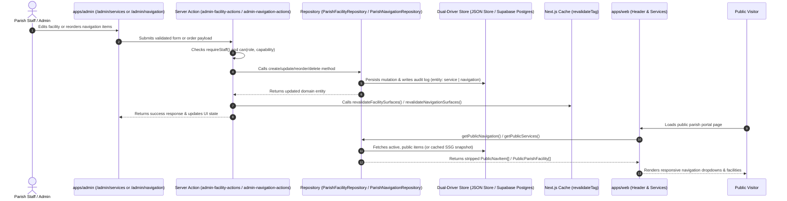

# Phase 7.2 Technical Architecture: Services and Navigation CMS

## 1. Architectural Summary

Phase 7.2 delivers a dynamic, full-lifecycle Content Management System (CMS) for **Parish Facilities (Public Services)** and **Navigation Menu Items (Dynamic Navbar & Drawers)**.

Previously, the church website relied on static seed structures for facilities and hardcoded route lists in the site header. Phase 7.2 transitions both subsystems into full-fledged CMS-managed domains backed by dual-driver repositories, granular role-based access controls, comprehensive audit logging, instant cache invalidation, and strict zero-auth public data projections.

### Owner Problem Resolved
- **Services & Facilities**: Church leadership and administrative staff can dynamically manage, schedule, describe, and toggle church services and facilities (such as specialized clinics, educational centers, the bookstore, scout rooms, nursery, and condolence halls) without developer intervention or codebase re-deployments.
- **Navigation Menus**: Administrative staff can dynamically adjust the public navigation hierarchy, manage nested dropdown menus (e.g. under "عن الكنيسة" or "الخدمات"), reorder menu priorities, and introduce seasonal links without touching layout JSX.

---

## 2. Invariant INV-01 Isolation & Security Architecture

Phase 7.2 adheres strictly to the foundational architectural invariants:

1. **Zero-Auth Public Isolation (INV-01)**:
   - Public visitors browsing `/services` or navigating the public portal require zero authentication.
   - Public readers (`getPublicServices`, `getServiceBySlug`, `getPublicNavigation`) query only active and public records (`is_active = true AND is_public = true`).
2. **Data Model Projection Stripping**:
   - Internal administrative tracking columns (`createdBy`, `updatedBy`, `createdAt`, `updatedAt`, `isActive`) are strictly stripped from the models before delivery to public components.
   - Public interfaces `PublicParishFacility` and `PublicNavItem` expose only user-facing presentation attributes.
3. **No-Env Static Build Resiliency**:
   - `apps/web` builds cleanly with zero environment variables, generating all static routes without failure.
   - Dual-driver architecture guarantees that when Supabase credentials are absent (e.g. SSG phase or local development), queries automatically fall back to the seeded file store without leaking secrets or failing builds.
4. **Staff Session & RBAC Enforcement**:
   - Every mutation in `apps/admin` enforces double authentication checks: session verification via `requireStaff()` and capability validation via `can()`.
   - Destructive operations (`services:delete`) are restricted strictly to the `owner` role.

---

## 3. End-to-End System Flow



---

## 4. Database Schema & Migration 15

Migration file: `supabase/migrations/20260916150000_services_navigation.sql`.

### 4.1 Expansion of Existing `public.public_services`
The baseline `public.public_services` table is enhanced with bilingual support, update tracking, and audit accountability:
- `name_en VARCHAR(200)`: English service name (optional).
- `description_en TEXT`: English description (optional).
- `updated_at TIMESTAMPTZ NOT NULL DEFAULT now()`: Last update timestamp.
- `created_by UUID REFERENCES public.profiles(id) ON DELETE SET NULL`: Creator staff profile.
- `updated_by UUID REFERENCES public.profiles(id) ON DELETE SET NULL`: Last updater staff profile.

### 4.2 Table: `public.nav_menu_items`
```sql
CREATE TABLE IF NOT EXISTS public.nav_menu_items (
    id UUID PRIMARY KEY DEFAULT gen_random_uuid(),
    key VARCHAR(100) NOT NULL UNIQUE,
    label_ar VARCHAR(150) NOT NULL,
    label_en VARCHAR(150),
    href VARCHAR(255) NOT NULL,
    section VARCHAR(50) NOT NULL DEFAULT 'main',
    parent_id UUID REFERENCES public.nav_menu_items(id) ON DELETE CASCADE,
    sort_order INT NOT NULL DEFAULT 0,
    is_active BOOLEAN NOT NULL DEFAULT TRUE,
    is_public BOOLEAN NOT NULL DEFAULT TRUE,
    created_by UUID REFERENCES public.profiles(id) ON DELETE SET NULL,
    updated_by UUID REFERENCES public.profiles(id) ON DELETE SET NULL,
    created_at TIMESTAMPTZ NOT NULL DEFAULT now(),
    updated_at TIMESTAMPTZ NOT NULL DEFAULT now()
);
```

### 4.3 Indexes & Performance
```sql
CREATE INDEX IF NOT EXISTS idx_nav_menu_items_public_active
    ON public.nav_menu_items (section, sort_order ASC)
    WHERE is_active = TRUE AND is_public = TRUE;

CREATE INDEX IF NOT EXISTS idx_nav_menu_items_parent
    ON public.nav_menu_items (parent_id)
    WHERE parent_id IS NOT NULL;
```

### 4.4 Row Level Security (RLS)
1. **Public Read**: Anonymous and authenticated users can select rows where `is_active = true AND is_public = true`.
2. **Staff Read**: Authenticated staff (`admin`, `secretary`) can view all records regardless of active/public status.
3. **Staff Mutations**: `INSERT`, `UPDATE`, and `DELETE` operations are restricted strictly to active staff members with `admin` or `secretary` roles.

---

## 5. Role-Based Access Control (RBAC)

Configured in `packages/domain/src/capabilities.ts`:

| Capability | Arabic Label | Viewer (`servant`) | Editor (`secretary`) | Owner (`admin`) | Audit Entity |
| :--- | :--- | :---: | :---: | :---: | :---: |
| `services:read` | عرض الخدمات الكنسية | Yes | Yes | Yes | `service` |
| `services:write` | إضافة وتعديل الخدمات | No | Yes | Yes | `service` |
| `services:delete` | حذف الخدمات الكنسية نهائياً | No | No | **Yes** | `service` |
| `navigation:read` | عرض عناصر شريط التنقل | Yes | Yes | Yes | `navigation` |
| `navigation:write` | إدارة وترتيب شريط التنقل | No | Yes | Yes | `navigation` |

---

## 6. Dual-Driver Repository Architecture

### 6.1 `ParishFacilityRepository` Interface
Defines the authoritative contract for managing church facilities and services:
- `listFacilities(filter?: ParishFacilityListFilter): Promise<ParishFacility[]>`
- `getFacilityById(id: string): Promise<ParishFacility | null>`
- `getFacilityBySlug(slug: string): Promise<ParishFacility | null>`
- `createFacility(input: CreateParishFacilityInput, actor: Actor): Promise<ParishFacility>`
- `updateFacility(id: string, input: UpdateParishFacilityInput, actor: Actor): Promise<ParishFacility>`
- `deleteFacility(id: string, actor: Actor): Promise<void>`
- `toggleActive(id: string, isActive: boolean, actor: Actor): Promise<ParishFacility>`

Implementations:
- `JsonParishFacilityRepository`: File-backed storage targeting `church-store.json` (Schema Version 5). Automatically seeds 8 canonical baseline facilities on first run.
- `SupabaseParishFacilityRepository`: PostgreSQL implementation executing typed queries against `public.public_services` and logging mutations to `public.audit_log`.

### 6.2 `ParishNavigationRepository` Interface
Defines the contract for menu hierarchy and navigation management:
- `listItems(filter?: NavItemListFilter): Promise<NavigationMenuItem[]>`
- `getItemById(id: string): Promise<NavigationMenuItem | null>`
- `getItemByKey(key: string): Promise<NavigationMenuItem | null>`
- `createItem(input: CreateNavItemInput, actor: Actor): Promise<NavigationMenuItem>`
- `updateItem(id: string, input: UpdateNavItemInput, actor: Actor): Promise<NavigationMenuItem>`
- `reorderItems(input: ReorderNavItemsInput, actor: Actor): Promise<NavigationMenuItem[]>`
- `deleteItem(id: string, actor: Actor): Promise<void>`
- `toggleActive(id: string, isActive: boolean, actor: Actor): Promise<NavigationMenuItem>`

Implementations:
- `JsonParishNavigationRepository`: File-backed storage with automatic schema version 5 migration, baseline seeding of 17 navigation nodes, hierarchy construction, and safe orphan reparenting upon deletion.
- `SupabaseParishNavigationRepository`: PostgreSQL implementation executing queries against `public.nav_menu_items`.

### 6.3 Store Document Schema Version 5
`packages/data-access/src/store/document.ts` defines `STORE_SCHEMA_VERSION = 5`, adding:
- `facilities: ParishFacility[]`
- `navItems: NavigationMenuItem[]`

Backward compatibility is preserved: documents with schema versions 1, 2, 3, or 4 are upgraded automatically during load without data loss.

---

## 7. Administrative Surfaces & Workflows

### 7.1 Services Manager (`/admin/services`)
- **Main View (`page.tsx`)**: Staff authentication check, capabilities resolution (`services:write`, `services:delete`), and data loading from `facilityRepo.listFacilities()`.
- **Table Component (`AdminServicesTable.tsx`)**:
  - Filterable by service type and search query.
  - Interactive toggle for active status (`toggleActive`).
  - Action buttons: "تعديل" (Edit) and "حذف" (Delete). Delete button is visible and active exclusively for users with the `services:delete` capability (Owner/Admin).
- **Modal Form (`AdminServiceModal.tsx`)**:
  - Comprehensive form handling Arabic and English names, slug, service type, detailed description, operating hours, physical location, phone, WhatsApp number, guidelines, display order, and active toggle.

### 7.2 Navigation Manager (`/admin/navigation`)
- **Main View (`page.tsx`)**: Authentication check, capability enforcement (`navigation:write`), and loading all navigation menu items.
- **Table Component (`AdminNavigationTable.tsx`)**:
  - Displays hierarchical tree structure indicating parent-child relationships.
  - Reorder controls (Move Up / Move Down) with instant state feedback and persistent batch saving.
  - Active status toggle.
  - Edit and Delete modal triggers with orphan re-parenting protection.
- **Modal Form (`AdminNavModal.tsx`)**:
  - Form handling unique key, Arabic and English labels, route destination (`href`), section (`main` or `secondary`), parent dropdown assignment (`parent_id`), sort order, and active/public toggles.

### 7.3 Cache Invalidation
Located in `packages/data-access/src/store/revalidate.ts`:
- `revalidateFacilitySurfaces()`: Invalidates `REVALIDATION_TAGS.facilities` and revalidates `/services` and `/`.
- `revalidateNavigationSurfaces()`: Invalidates `REVALIDATION_TAGS.navigation` and revalidates `/`.

---

## 8. Public Web Integration: Dynamic Header

### 8.1 Server Header (`apps/web/src/components/layout/Header.tsx`)
- Server component that fetches dynamic navigation hierarchy via `getPublicNavigation()` and public facilities list via `getPublicFacilities()`.
- Passes the navigation tree and facilities data as serialized props to the client header.
- Fully resilient: in case of store or database absence during static generation, cleanly falls back to canonical seed navigation (`SEED_PUBLIC_NAVIGATION`).

### 8.2 Client Header (`apps/web/src/components/layout/HeaderClient.tsx`)
- Renders responsive desktop navbar and mobile drawer.
- Implements interactive dropdown menus (e.g. for multi-level child items) with accessible ARIA tags (`aria-expanded`, `aria-haspopup`).
- Automatically enriches the "الخدمات الكنسية" menu item with live public facility links when available.
- Maintains strict RTL layout, high-contrast gold accents, and font size switching compatibility.

---

## 9. Quality Gate Verification (G1–G6)

All six quality gates were verified directly on the repository with 100% pass rates:

| Gate | Check | Exact Command | Pass Condition | Result | Proof Details |
| :--- | :--- | :--- | :--- | :--- | :--- |
| **G1** | Monorepo Typecheck | `pnpm typecheck` | 0 errors across 5 workspace projects | **PASS** | 0 errors (`packages/domain`, `packages/ui`, `packages/data-access`, `apps/admin`, `apps/web`) |
| **G2** | Monorepo Lint | `pnpm lint` | `eslint .` passes with 0 errors | **PASS** | 0 errors |
| **G3** | Test Suite (Vitest) | `pnpm test` | 100% tests green across monorepo | **PASS** | **498/498 tests passed across 39 test files** (Duration: 46.06s) |
| **G4** | Web Production Build | `pnpm --filter web build` | Zero-env static build (INV-01) | **PASS** | **52/52 static pages generated**, includes `/services` & `/services/[slug]` |
| **G5** | Admin Production Build | `pnpm --filter admin build` | All admin routes compile cleanly | **PASS** | Successful compile for `/services` (6.93 kB) and `/navigation` (6.5 kB) |
| **G6** | E2E Services & Nav Proof | `vitest run e2e-services-navigation-proof` | Full lifecycle verified on file store | **PASS** | Proved CRUD, audit logging, INV-01 stripping, hierarchy, reorder, reparenting |
